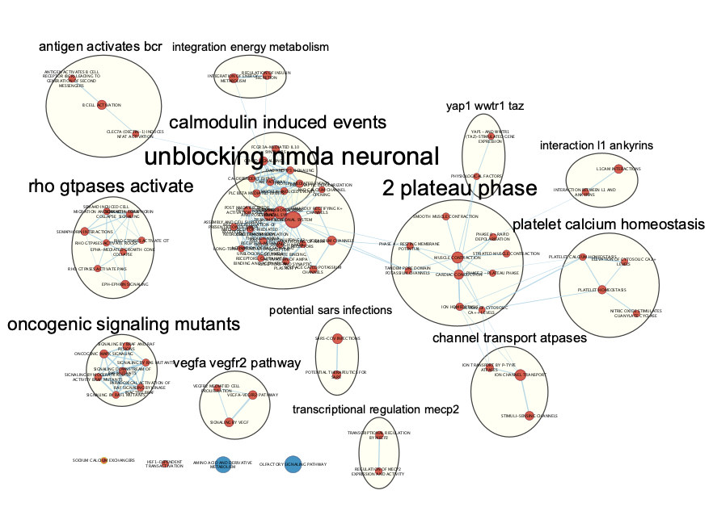

```{r, include = FALSE}
knitr::opts_chunk$set(
  collapse = TRUE,
  comment = "#>",
  fig.path = "man/figures/",
  out.width = "100%"
)
```

# FEDUP

[](https://travis-ci.com/rosscm/FEDUP)


[](https://codecov.io/gh/rosscm/FEDUP)

`FEDUP` is an R package that tests for enrichment and depletion of user-defined
pathways using a Fisher's exact test. The method is designed for versatile
pathway annotation formats (eg. gmt, txt, xlsx) to allow the user to run
pathway analysis on custom annotations. This package is also
integrated with Cytoscape to provide network-based pathway visualization
that enhances the interpretability of the results.

# Getting started
## System prerequisites

**R version** ≥ 4.1  
**R packages**:

-   **CRAN**: openxlsx, tibble, dplyr, data.table, ggplot2, ggthemes,
    forcats, RColorBrewer  
-   **Bioconductor**: RCy3

## Installation

Install `FEDUP` via devtools:

```{r, message = FALSE}
devtools::install_github("rosscm/FEDUP", quiet = TRUE)
```

# Running the package
## Sample input

Load test genes (`testGene`), background genes (`backgroudGene`), and
pathways (`pathwaysGMT`):

Note, the sample `testGene` object only consists of genes from the pathway
`MUSCLE CONTRACTION%REACTOME DATABASE ID RELEASE 74%397014`. So we would expect
to see strong **enrichment** for pathways related to muscle contraction and,
**depletion** for pathways *not* associated with muscle contraction. Let's see!

```{r}
library(FEDUP)
data(testGene)
data(backgroundGene)
data(pathwaysGMT)
```

Take a look at the data structure:

```{r}
str(testGene)
str(backgroundGene)
str(head(pathwaysGMT))
```

Now use `runFedup` on sample data:

```{r}
fedupRes <- runFedup(testGene, backgroundGene, pathwaysGMT)
```

View output results table sorted by pvalue:

```{r}
print(head(fedupRes[which(fedupRes$status == "Enriched"),]))
print(head(fedupRes[which(fedupRes$status == "Depleted"),]))
```

Here we see the strongest enrichment for the `MUSCLE CONTRACTION` pathway.
Since our test set of genes are exclusively from this pathway, this is totally
expected. We also see significant enrichment for other muscle contraction
pathways, including `CARDIAC CONDUCTION` and `SMOOTH MUSCLE CONTRACTION`.
Conversely, we see significant depletion for functions not associated with
muscle contraction, such as `OLFACTORY SIGNALING PATHWAY` and
`AMINO ACID AND DERIVATIVE METABOLISM`. Nice!

Plot enriched and depleted pathways (qvalue < 0.05) in the form of a dot plot
via the `plotDotPlot` function:

```{r, FEDUP_dotplot, fig.width = 9, fig.height = 9.5}
fedupPlot <- fedupRes[which(fedupRes$qvalue < 0.05),]
fedupPlot$log10qvalue <- -log10(fedupPlot$qvalue + 1e-10) # -log10(qvalue)
fedupPlot$pathway <- gsub("\\%.*", "", fedupPlot$pathway) # clean names

p <- plotDotPlot(
  df = fedupPlot,
  xVar = "log10qvalue",
  yVar = "pathway",
  xLab = "-log10(Qvalue)",
  fillVar = "status",
  fillLab = "Enrichment\nstatus",
  sizeVar = "fold_enrichment",
  sizeLab = "Fold enrichment"
)

p <- p + # facet by status to separate enriched and depleted pathways
  ggplot2::facet_grid("status", scales = "free", space = "free") +
  ggplot2::theme(strip.text.y = ggplot2::element_blank())
print(p)
```

Look at all those chick... enrichments! This is a bit overwhelming, isn't it?
How do we interpret these 76 seemingly redundant pathways in a way that doesn't
hurt our tired brains even more? Oh I know, let's use EnrichmentMap!

First, make sure to have
[Cytoscape](https://cytoscape.org/download.html) downloaded and and open
on your computer. You’ll also need to install the
[EnrichmentMap](http://apps.cytoscape.org/apps/enrichmentmap) and
[AutoAnnotate](http://apps.cytoscape.org/apps/autoannotate) apps.

Then format results for compatibility with EnrichmentMap with `writeFemap`:

```{r}
resultsFile <- tempfile("fedupRes", fileext = ".txt")
writeFemap(fedupRes, resultsFile)
````

Prepare a pathway annotation file (gmt format) from the pathway list you
passed to `runFedup` using the `writePathways` function (you don't need to run
this function if your pathway annotations are already in gmt format, but it
doesn't hurt to make sure):

```{r}
gmtFile <- tempfile("pathwaysGMT", fileext = ".gmt")
writePathways(pathwaysGMT, gmtFile)
```

Cytoscape is open right? If so, run these lines and let the `plotFemap`
magic happen:

```{r, FEDUP_EM}
netFile <- tempfile("FEDUP_EM", fileext = ".png")
plotFemap(
  gmtFile = gmtFile,
  resultsFile = resultsFile,
  qvalue = 0.05,
  netName = "FEDUP_EM",
  netFile = netFile
)
```



After some manual rearrangement of the annotated pathway clusters, this is the
resulting EnrichmentMap we get from our `FEDUP` results. Much better!

This has effectively summarized the 76 pathways from our dot plot into 14 unique
biological themes (including 4 unclustered pathways). We can now see clear
themes in the data pertaining to muscle contraction, such as `NMDA receptor
function`, `calcium homeostasis`, and `ATPase transport`.

Try this out yourself! Hopefully it’s the only fedup you achieve
:grimacing:

# Versioning

For the versions available, see the [tags on this
repo](https://github.com/rosscm/FEDUP/tags).

# Shoutouts

:sparkles:[**2020**](https://media.giphy.com/media/z9AUvhAEiXOqA/giphy.gif):sparkles:
