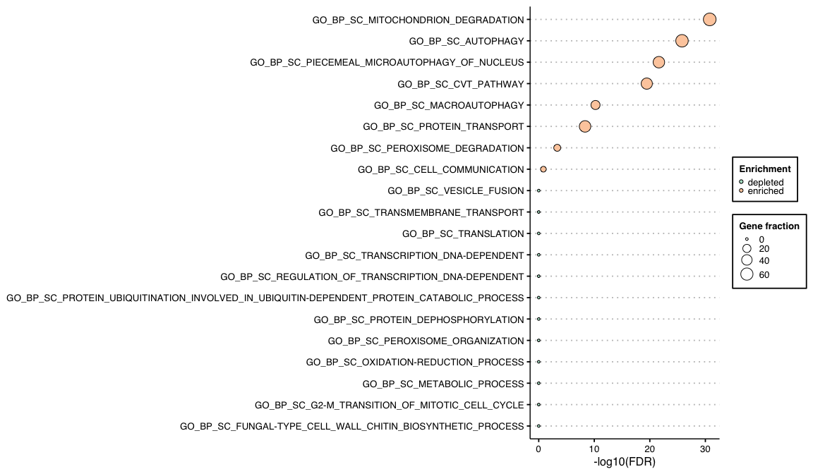

FEDUP
================

`FEDUP` is an R package for gene enrichment and depletion analysis on
user-defined pathways using a Fisher’s exact test.

## Prerequisites

R version &gt; 3.5.0

R packages:  
- **CRAN**: openxlsx, tibble, data.table, ggplot2, ggthemes, forcats,
and RColorBrewer  
- **Bioconductor**: RCy3

## Getting started

Install FEDUP via devtools

``` r
library(devtools)
#install_github("rosscm/FEDUP")
devtools::load_all()
```

Load libraries

``` r
library(openxlsx)
library(tibble)
library(data.table)
library(ggplot2)
library(ggthemes)
library(forcats)
library(RColorBrewer)
library(RCy3)
```

## Quick run

### Input data

Load example test genes, background genes, and pathways

``` r
data(testGene)
data(backgroundGene)
data(pathwaysGMT)
```

Take a look at the data structure

``` r
str(testGene)
#>  chr [1:33] "STT4" "ATG8" "AIM26" "DCK1" "LMO1" "ATG2" "ATG21" "SCM4" ...
str(backgroundGene)
#>  chr [1:5063] "SCO2" "HXT15" "FUR4" "MSB2" "VPH2" "NTO1" "NET1" "NIP100" ...
str(pathwaysGMT)
#> List of 256
#>  $ GO_BP_SC_PROTEIN_PHOSPHORYLATION                                                                    : chr [1:126] "SGV1" "PAN3" "MKK2" "YCK3" ...
#>  $ GO_BP_SC_INTRACELLULAR_PROTEIN_TRANSPORT                                                            : chr [1:84] "SXM1" "VTI1" "ARF3" "SSO2" ...
#>  $ GO_BP_SC_SMALL_GTPASE_MEDIATED_SIGNAL_TRANSDUCTION                                                  : chr [1:45] "RHO1" "ARF3" "LTE1" "CDC43" ...
#>  $ GO_BP_SC_NUCLEOTIDE_METABOLIC_PROCESS                                                               : chr [1:10] "SUR4" "DUT1" "AMD1" "URC2" ...
#>  $ GO_BP_SC_METABOLIC_PROCESS                                                                          : chr [1:350] "SUR4" "ACO2" "CRG1" "OYE3" ...
#>  $ GO_BP_SC_TRANSLATION                                                                                : chr [1:234] "MRPL24" "DBP1" "MRPL9" "UTP30" ...
#>  $ GO_BP_SC_MITOCHONDRIAL_TRANSLATION                                                                  : chr [1:65] "MRPL24" "MRPL11" "MRP51" "MRPL36" ...
#>  $ GO_BP_SC_TRANSCRIPTION_DNA-DEPENDENT                                                                : chr [1:277] "ASK10" "GCN4" "WHI5" "CDC36" ...
#>  $ GO_BP_SC_CELLULAR_RESPONSE_TO_OXIDATIVE_STRESS                                                      : chr [1:48] "ASK10" "GRX4" "AHP1" "YJR096W" ...
#>  $ GO_BP_SC_TRANSMEMBRANE_TRANSPORT                                                                    : chr [1:211] "YEA4" "PXA1" "QDR2" "CAN1" ...
#>  $ GO_BP_SC_FUNGAL-TYPE_CELL_WALL_CHITIN_BIOSYNTHETIC_PROCESS                                          : chr [1:10] "YEA4" "GFA1" "BCH1" "BMH2" ...
#>  $ GO_BP_SC_TRICARBOXYLIC_ACID_CYCLE                                                                   : chr [1:26] "ACO2" "TIM18" "LSC1" "MDH2" ...
#>  $ GO_BP_SC_IRON-SULFUR_CLUSTER_ASSEMBLY                                                               : chr [1:16] "ISA1" "NFS1" "CFD1" "ASF1" ...
#>  $ GO_BP_SC_UBIQUITIN-DEPENDENT_PROTEIN_CATABOLIC_PROCESS                                              : chr [1:49] "CUL3" "SAS4" "UBP3" "PRE8" ...
#>  $ GO_BP_SC_PROTEIN_UBIQUITINATION_INVOLVED_IN_UBIQUITIN-DEPENDENT_PROTEIN_CATABOLIC_PROCESS           : chr [1:11] "CUL3" "CDC4" "MDM30" "UBC8" ...
#>  $ GO_BP_SC_G2-M_TRANSITION_OF_MITOTIC_CELL_CYCLE                                                      : chr [1:13] "YBP2" "CDC4" "CLB4" "CLB1" ...
#>  $ GO_BP_SC_REGULATION_OF_TRANSCRIPTION_DNA-DEPENDENT                                                  : chr [1:306] "GCN4" "WHI5" "HAA1" "CDC36" ...
#>  $ GO_BP_SC_NEGATIVE_REGULATION_OF_TRANSCRIPTION_FROM_RNA_POLYMERASE_II_PROMOTER                       : chr [1:40] "GCN4" "CDC36" "NUT2" "FKH2" ...
#>  $ GO_BP_SC_CELLULAR_AMINO_ACID_BIOSYNTHETIC_PROCESS                                                   : chr [1:66] "GCN4" "HOM3" "ARO3" "LEU4" ...
#>  $ GO_BP_SC_CELL_CYCLE                                                                                 : chr [1:215] "WHI5" "MCD1" "BUB3" "LTE1" ...
#>  $ GO_BP_SC_REGULATION_OF_CELL_SIZE                                                                    : chr [1:14] "WHI5" "YCR061W" "WHI4" "VPS51" ...
#>  $ GO_BP_SC_PEROXISOME_ORGANIZATION                                                                    : chr [1:11] "PEX3" "PEX1" "DNM1" "VPS1" ...
#>  $ GO_BP_SC_RIBOSOME_BIOGENESIS                                                                        : chr [1:105] "MRPL11" "NOP6" "UTP30" "UTP23" ...
#>  $ GO_BP_SC_METHYLATION                                                                                : chr [1:39] "CRG1" "NCL1" "CTM1" "EMG1" ...
#>  $ GO_BP_SC_DEPHOSPHORYLATION                                                                          : chr [1:19] "PTP3" "YOR283W" "CDC14" "MSG5" ...
#>  $ GO_BP_SC_PROTEIN_DEPHOSPHORYLATION                                                                  : chr [1:22] "PTP3" "GIP2" "PTC4" "PPT1" ...
#>  $ GO_BP_SC_FUNGAL-TYPE_CELL_WALL_ORGANIZATION                                                         : chr [1:75] "ACK1" "ECM7" "FMP45" "ATG32" ...
#>  $ GO_BP_SC_INTRA-GOLGI_VESICLE-MEDIATED_TRANSPORT                                                     : chr [1:18] "VTI1" "COG7" "COY1" "AGE1" ...
#>  $ GO_BP_SC_PROTEIN_TRANSPORT                                                                          : chr [1:256] "VTI1" "NUP84" "ARF3" "STP22" ...
#>  $ GO_BP_SC_VESICLE-MEDIATED_TRANSPORT                                                                 : chr [1:101] "VTI1" "ARF3" "SSO2" "YCK3" ...
#>  $ GO_BP_SC_GOLGI_TO_VACUOLE_TRANSPORT                                                                 : chr [1:20] "VTI1" "APM2" "VPS52" "VPS53" ...
#>  $ GO_BP_SC_VESICLE_FUSION                                                                             : chr [1:10] "VTI1" "BOS1" "BET1" "VAM3" ...
#>  $ GO_BP_SC_VACUOLE_FUSION_NON-AUTOPHAGIC                                                              : chr [1:19] "VTI1" "OPT2" "VAM3" "VAM7" ...
#>  $ GO_BP_SC_TRANSPOSITION_RNA-MEDIATED                                                                 : chr [1:90] "YDR261W-A" "YOR192C-B" "YDR034C-C" "YLR256W-A" ...
#>  $ GO_BP_SC_OXIDATION-REDUCTION_PROCESS                                                                : chr [1:271] "OYE3" "YNL134C" "PRO2" "HMG1" ...
#>  $ GO_BP_SC_APOPTOTIC_PROCESS                                                                          : chr [1:17] "OYE3" "MCD1" "MCA1" "AIF1" ...
#>  $ GO_BP_SC_MITOCHONDRIAL_ELECTRON_TRANSPORT_CYTOCHROME_C_TO_OXYGEN                                    : chr [1:12] "COX6" "COX1" "COX8" "COX3" ...
#>  $ GO_BP_SC_RESPONSE_TO_DNA_DAMAGE_STIMULUS                                                            : chr [1:95] "NUP84" "MCD1" "DNL4" "UBI4" ...
#>  $ GO_BP_SC_MRNA_EXPORT_FROM_NUCLEUS                                                                   : chr [1:25] "NUP84" "APQ12" "GFD1" "MIP6" ...
#>  $ GO_BP_SC_NUCLEAR_PORE_ORGANIZATION                                                                  : chr [1:15] "NUP84" "NUP53" "NUP85" "ASM4" ...
#>  $ GO_BP_SC_MRNA_TRANSPORT                                                                             : chr [1:44] "NUP84" "YRA2" "DHH1" "NUP42" ...
#>  $ GO_BP_SC_NUCLEOCYTOPLASMIC_TRANSPORT                                                                : chr [1:30] "NUP84" "NUP42" "NUP53" "NPA3" ...
#>  $ GO_BP_SC_PROTEIN_EXPORT_FROM_NUCLEUS                                                                : chr [1:19] "NUP84" "NUP85" "BCP1" "CRM1" ...
#>  $ GO_BP_SC_TRNA_EXPORT_FROM_NUCLEUS                                                                   : chr [1:15] "NUP84" "CEX1" "NUP85" "NUP49" ...
#>  $ GO_BP_SC_NLS-BEARING_SUBSTRATE_IMPORT_INTO_NUCLEUS                                                  : chr [1:18] "NUP84" "NUP42" "NUP53" "NUP85" ...
#>  $ GO_BP_SC_POSTTRANSCRIPTIONAL_TETHERING_OF_RNA_POLYMERASE_II_GENE_DNA_AT_NUCLEAR_PERIPHERY           : chr [1:12] "NUP84" "NUP42" "LRP1" "NUP157" ...
#>  $ GO_BP_SC_MRNA-BINDING_HNRNP_PROTEIN_IMPORT_INTO_NUCLEUS                                             : chr [1:10] "NUP84" "NUP85" "NUP157" "NUP2" ...
#>  $ GO_BP_SC_ION_TRANSPORT                                                                              : chr [1:95] "HNM1" "QDR2" "CTR3" "ATP20" ...
#>  $ GO_BP_SC_COPPER_ION_TRANSPORT                                                                       : chr [1:11] "HNM1" "CTR3" "CCC2" "FRE7" ...
#>  $ GO_BP_SC_CATION_TRANSPORT                                                                           : chr [1:30] "PMR1" "NEO1" "NHA1" "PMA2" ...
#>  $ GO_BP_SC_ATP_BIOSYNTHETIC_PROCESS                                                                   : chr [1:22] "PMR1" "ATP20" "PMA2" "ATP1" ...
#>  $ GO_BP_SC_REGULATION_OF_TRANSCRIPTION_FROM_RNA_POLYMERASE_II_PROMOTER                                : chr [1:64] "CDC36" "SSN2" "NRG1" "CAF16" ...
#>  $ GO_BP_SC_PROTEIN_UBIQUITINATION                                                                     : chr [1:37] "CDC36" "UBI4" "APC5" "UPF3" ...
#>  $ GO_BP_SC_TRANSCRIPTION_ELONGATION_FROM_RNA_POLYMERASE_II_PROMOTER                                   : chr [1:17] "CDC36" "NPL6" "CDC39" "NOT5" ...
#>  $ GO_BP_SC_REGULATION_OF_CELL_CYCLE                                                                   : chr [1:20] "CDC36" "CLB4" "CLB1" "ESA1" ...
#>  $ GO_BP_SC_NUCLEOTIDE-EXCISION_REPAIR                                                                 : chr [1:14] "SSL2" "DPB11" "RAD23" "MET18" ...
#>  $ GO_BP_SC_GLYCOLYSIS                                                                                 : chr [1:22] "PFK1" "YOR283W" "ENO2" "PDA1" ...
#>  $ GO_BP_SC_ENDOCYTOSIS                                                                                : chr [1:57] "ARF3" "NEO1" "OSH3" "BSP1" ...
#>  $ GO_BP_SC_CELLULAR_BUD_SITE_SELECTION                                                                : chr [1:20] "ARF3" "BUD9" "BUD4" "BUD31" ...
#>  $ GO_BP_SC_ACTIN_CORTICAL_PATCH_LOCALIZATION                                                          : chr [1:13] "ARF3" "BSP1" "CDC50" "AFI1" ...
#>  $ GO_BP_SC_CHROMATIN_SILENCING_AT_TELOMERE                                                            : chr [1:24] "DLS1" "ADA2" "HAT1" "FUN30" ...
#>  $ GO_BP_SC_TRANSLATIONAL_INITIATION                                                                   : chr [1:28] "SUA7" "DBP1" "BRF1" "GCD1" ...
#>  $ GO_BP_SC_CARBOHYDRATE_METABOLIC_PROCESS                                                             : chr [1:87] "IMA4" "XYL2" "ATH1" "ALG13" ...
#>  $ GO_BP_SC_PROTEIN_FOLDING                                                                            : chr [1:70] "CNS1" "HSC82" "CPR6" "CPR2" ...
#>  $ GO_BP_SC_CHROMATIN_SILENCING_AT_SILENT_MATING-TYPE_CASSETTE                                         : chr [1:20] "ESC2" "YKU70" "FUN30" "ORC1" ...
#>  $ GO_BP_SC_MITOTIC_SISTER_CHROMATID_COHESION                                                          : chr [1:14] "ESC2" "NPA3" "MPS3" "KAR3" ...
#>  $ GO_BP_SC_RESPONSE_TO_STRESS                                                                         : chr [1:98] "TIP20" "FMP45" "FRT1" "ARO3" ...
#>  $ GO_BP_SC_NUCLEAR-TRANSCRIBED_MRNA_CATABOLIC_PROCESS_NONSENSE-MEDIATED_DECAY                         : chr [1:14] "DCS1" "DCS2" "UPF3" "EDC1" ...
#>  $ GO_BP_SC_BIOSYNTHETIC_PROCESS                                                                       : chr [1:39] "FOL3" "LCB1" "HEM1" "ARO3" ...
#>  $ GO_BP_SC_ONE-CARBON_METABOLIC_PROCESS                                                               : chr [1:10] "FOL3" "GCV3" "MIS1" "SAH1" ...
#>  $ GO_BP_SC_ASCOSPORE_FORMATION                                                                        : chr [1:25] "FMP45" "UBI4" "ADE16" "YOR338W" ...
#>  $ GO_BP_SC_SPORULATION_RESULTING_IN_FORMATION_OF_A_CELLULAR_SPORE                                     : chr [1:41] "FMP45" "CDC4" "LOH1" "MDS3" ...
#>  $ GO_BP_SC_CELLULAR_PROTEIN_MODIFICATION_PROCESS                                                      : chr [1:17] "STP22" "TOM1" "RSP5" "PBY1" ...
#>  $ GO_BP_SC_PROTEOLYSIS                                                                                : chr [1:131] "YFR018C" "YKL100C" "YOR192C-B" "UBP3" ...
#>  $ GO_BP_SC_ACTIN_CYTOSKELETON_ORGANIZATION                                                            : chr [1:22] "CAP1" "CAP2" "GRX4" "AKL1" ...
#>  $ GO_BP_SC_RETROGRADE_VESICLE-MEDIATED_TRANSPORT_GOLGI_TO_ER                                          : chr [1:16] "NEO1" "VPS74" "DSL1" "USE1" ...
#>  $ GO_BP_SC_VACUOLE_ORGANIZATION                                                                       : chr [1:12] "NEO1" "YHC3" "VPS41" "VPS33" ...
#>  $ GO_BP_SC_PHOSPHOLIPID_TRANSPORT                                                                     : chr [1:10] "NEO1" "MDM34" "MDM12" "DNF1" ...
#>  $ GO_BP_SC_RRNA_PROCESSING                                                                            : chr [1:111] "NOP6" "LSM5" "UTP30" "UTP23" ...
#>  $ GO_BP_SC_RIBOSOMAL_SMALL_SUBUNIT_BIOGENESIS                                                         : chr [1:16] "NOP6" "UTP30" "EMG1" "NOC4" ...
#>  $ GO_BP_SC_PSEUDOURIDINE_SYNTHESIS                                                                    : chr [1:10] "PUS4" "PUS2" "PUS5" "PUS6" ...
#>  $ GO_BP_SC_RNA_PROCESSING                                                                             : chr [1:27] "PUS4" "CLF1" "RNT1" "UTP6" ...
#>  $ GO_BP_SC_RNA_MODIFICATION                                                                           : chr [1:10] "PUS4" "PUS2" "PUS5" "PUS6" ...
#>  $ GO_BP_SC_DNA_RECOMBINATION                                                                          : chr [1:68] "YOR192C-B" "RAD52" "DNL4" "YHL009W-B" ...
#>  $ GO_BP_SC_DNA_INTEGRATION                                                                            : chr [1:44] "YOR192C-B" "YHL009W-B" "YDR098C-B" "YCL019W" ...
#>  $ GO_BP_SC_TRANSPOSITION                                                                              : chr [1:39] "YOR192C-B" "YHL009W-B" "YDR098C-B" "YCL019W" ...
#>  $ GO_BP_SC_VIRAL_PROCAPSID_MATURATION                                                                 : chr [1:40] "YOR192C-B" "YHL009W-B" "YDR098C-B" "YCL019W" ...
#>  $ GO_BP_SC_PSEUDOHYPHAL_GROWTH                                                                        : chr [1:32] "ECM23" "OSH3" "NRG1" "FKH2" ...
#>  $ GO_BP_SC_MITOCHONDRION_DEGRADATION                                                                  : chr [1:25] "ATG32" "ATG7" "ATG8" "ATG1" ...
#>  $ GO_BP_SC_AUTOPHAGY                                                                                  : chr [1:39] "ATG32" "ATG26" "ATG34" "ATG14" ...
#>  $ GO_BP_SC_DNA_REPAIR                                                                                 : chr [1:98] "MGS1" "RAD52" "DNL4" "UBI4" ...
#>  $ GO_BP_SC_POTASSIUM_ION_TRANSPORT                                                                    : chr [1:10] "QDR2" "NHX1" "YDL183C" "YLH47" ...
#>  $ GO_BP_SC_AMINO_ACID_TRANSPORT                                                                       : chr [1:41] "CAN1" "MUP1" "VBA4" "BAP3" ...
#>  $ GO_BP_SC_AMINO_ACID_TRANSMEMBRANE_TRANSPORT                                                         : chr [1:23] "CAN1" "MUP1" "BAP3" "PUT4" ...
#>  $ GO_BP_SC_PROTEIN_O-LINKED_GLYCOSYLATION                                                             : chr [1:16] "PMT1" "KTR3" "MNT4" "PMT6" ...
#>  $ GO_BP_SC_MITOSIS                                                                                    : chr [1:89] "MCD1" "LTE1" "NKP1" "CDC4" ...
#>  $ GO_BP_SC_CELL_DIVISION                                                                              : chr [1:131] "MCD1" "LTE1" "NKP1" "BUD4" ...
#>  $ GO_BP_SC_CHROMOSOME_SEGREGATION                                                                     : chr [1:41] "MCD1" "DSN1" "GIP4" "DAD2" ...
#>  $ GO_BP_SC_ESTABLISHMENT_OF_MITOTIC_SISTER_CHROMATID_COHESION                                         : chr [1:11] "MCD1" "CHL4" "MCM22" "MCM21" ...
#>   [list output truncated]
```

Run FEDUP on sample data

``` r
fedup_res <- runFedup(testGene, backgroundGene, pathwaysGMT)
```

Head of output results table sorted by FDR

``` r
fedup_res <- fedup_res[order(fedup_res$fdr),]
head(fedup_res)
#>                                        pathways size real_total real_pathway
#> 1:           GO_BP_SC_MITOCHONDRION_DEGRADATION   25         33           22
#> 2:                           GO_BP_SC_AUTOPHAGY   39         33           21
#> 3: GO_BP_SC_PIECEMEAL_MICROAUTOPHAGY_OF_NUCLEUS   29         33           17
#> 4:                         GO_BP_SC_CVT_PATHWAY   32         33           16
#> 5:                      GO_BP_SC_MACROAUTOPHAGY   22         33            9
#> 6:                   GO_BP_SC_PROTEIN_TRANSPORT  256         33           17
#>    real_pathway_frac expected_total expected_pathway expected_pathway_frac
#> 1:          66.66667           5063               22             0.4345250
#> 2:          63.63636           5063               38             0.7505432
#> 3:          51.51515           5063               28             0.5530318
#> 4:          48.48485           5063               32             0.6320363
#> 5:          27.27273           5063               22             0.4345250
#> 6:          51.51515           5063              252             4.9772862
#>    enrichment                      real_pathway_gene       pvalue          fdr
#> 1:   enriched   ATG8,AIM26,ATG2,ATG21,ATG7,ATG10,... 6.415029e-34 1.642248e-31
#> 2:   enriched   ATG8,AIM26,ATG2,ATG21,ATG7,ATG10,... 1.255476e-28 1.607009e-26
#> 3:   enriched    ATG8,ATG2,ATG21,ATG7,ATG10,ATG1,... 2.731028e-24 2.330477e-22
#> 4:   enriched    ATG8,ATG2,ATG21,ATG7,ATG10,ATG1,... 5.536302e-22 3.543233e-20
#> 5:   enriched ATG21,ATG7,ATG10,ATG13,ATG20,ATG16,... 1.180566e-12 6.044496e-11
#> 6:   enriched    ATG8,ATG2,ATG21,ATG7,ATG10,ATG1,... 1.072886e-10 4.577646e-09
```

### Visualization

Plot top pathway enrichment/depletion results

``` r
fedup_res$log10fdr <- -log10(fedup_res$fdr) # log10-transform FDR for plotting
fedup_plot <- fedup_res[head(order(fdr, real_pathway_frac), 20),]
plotDotPlot(df = fedup_plot,
            x_var = "log10fdr",
            y_var = "pathways",
            x_lab = "-log10(FDR)",
            fill_var = "enrichment",
            fill_lab = "Enrichment",
            size_var = "real_pathway_frac",
            size_lab = "Gene fraction")
```

<!-- -->

## Versioning

For the versions available, see the [tags on this
repo](https://github.com/rosscm/FEDUP/tags).

## Acknowledgments

2020! FEDUP!
