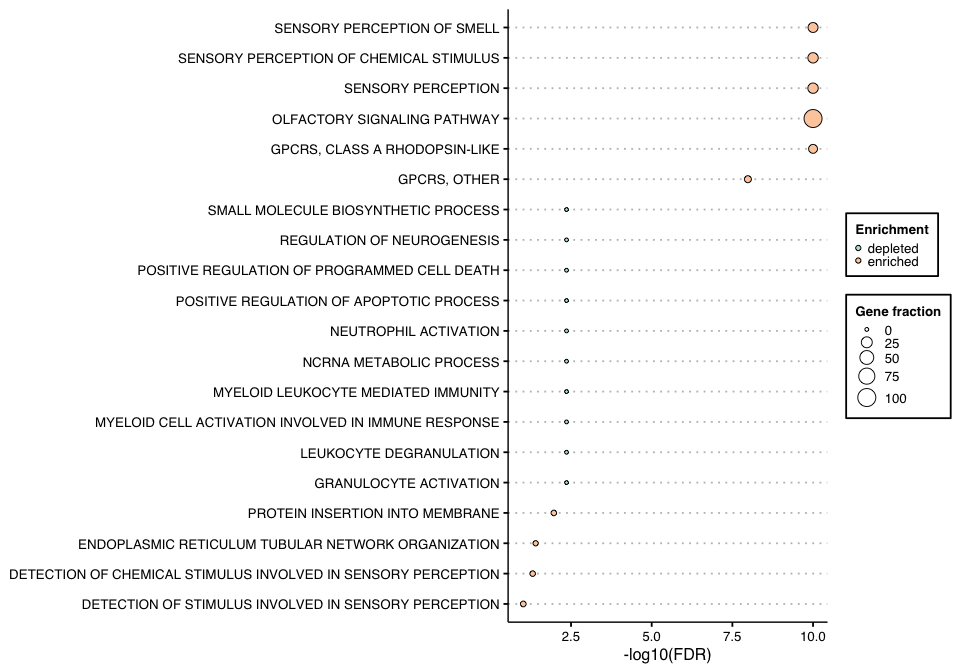

FEDUP
================

`FEDUP` is an R package for gene enrichment and depletion analysis on
user-defined pathways using a Fisher’s exact test.

## Prerequisites

R version &gt; 3.5.0

R packages:  
- **CRAN**: openxlsx, tibble, data.table, ggplot2, ggthemes, forcats,
and RColorBrewer  
- **Bioconductor**: RCy3

## Getting started

Install FEDUP via devtools

``` r
library(devtools)
#install_github("rosscm/FEDUP")
devtools::load_all()
```

Load libraries

``` r
library(openxlsx)
library(tibble)
library(data.table)
library(ggplot2)
library(ggthemes)
library(forcats)
library(RColorBrewer)
library(RCy3)
```

## Quick run

### Input data

Load example test genes, background genes, and pathways  
&gt; To note, the test genes comprise solely of the **olfactory
signalling** pathway. As such, we would expect to see strong
*enrichment* for olfactory-associated pathways and *depletion* for
pathways not associated with olfactory signalling.

``` r
data(testGene)
data(backgroundGene)
data(pathwaysGMT)
```

Take a look at the data structure

``` r
str(testGene)
#>  chr [1:396] "OR11A1" "OR8A1" "OR8I2" "OR52N1" "OR52N5" "OR52N4" "OR52N2" ...
str(backgroundGene)
#>  chr [1:15965] "ELOVL1" "ACOT7" "ACSL1" "ACSL5" "ACSL4" "ELOVL6" "ACSL3" ...
str(pathwaysGMT)
#> List of 8080
#>  $ STEARATE BIOSYNTHESIS I (ANIMALS)%HUMANCYC%PWY-5972                                                                                                                                                           : chr [1:13] "ELOVL1" "ACOT7" "ACSL1" "ACSL5" ...
#>  $ SUPERPATHWAY OF INOSITOL PHOSPHATE COMPOUNDS%HUMANCYC%PWY-6371                                                                                                                                                : chr [1:67] "PI4K2B" "MTMR14" "PTEN" "INPPL1" ...
#>  $ PUTRESCINE DEGRADATION III%HUMANCYC%PWY-0                                                                                                                                                                     : chr [1:10] "ALDH3B1" "SAT2" "SAT1" "ALDH3A2" ...
#>  $ TRYPTOPHAN DEGRADATION III (EUKARYOTIC)%HUMANCYC%TRYPTOPHAN-DEGRADATION-1                                                                                                                                     : chr [1:11] "KYNU" "AFMID" "ACAA1" "KMO" ...
#>  $ MEVALONATE PATHWAY I%HUMANCYC%PWY-922                                                                                                                                                                         : chr [1:12] "IDI1" "MVK" "ACAA1" "HMGCS1" ...
#>  $ D-<I>MYO< I>-INOSITOL-5-PHOSPHATE METABOLISM%HUMANCYC%PWY-6367                                                                                                                                                : chr [1:19] "PLCE1" "PLCG2" "PIP4K2A" "PIP4K2C" ...
#>  $ PURINE NUCLEOTIDES DEGRADATION II (AEROBIC)%HUMANCYC%PWY-6353                                                                                                                                                 : chr [1:11] "NT5C3A" "NT5C3B" "NT5E" "GDA" ...
#>  $ PHOSPHATIDYLGLYCEROL BIOSYNTHESIS II (NON-PLASTIDIC)%HUMANCYC%PWY4FS-8                                                                                                                                        : chr [1:18] "GPD2" "LPCAT3" "GPAT2" "CDS2" ...
#>  $ FATTY ACID &ALPHA;-OXIDATION II%HUMANCYC%PWY66-387                                                                                                                                                            : chr [1:10] "ACSBG1" "ACSBG2" "SLC27A2" "ACSL1" ...
#>  $ TRNA CHARGING%HUMANCYC%TRNA-CHARGING-PWY                                                                                                                                                                      : chr [1:37] "CARS" "AARS2" "VARS" "TARSL2" ...
#>  $ SUPERPATHWAY OF D-<I>MYO< I>-INOSITOL (1,4,5)-TRISPHOSPHATE METABOLISM%HUMANCYC%PWY-6358                                                                                                                      : chr [1:20] "INPP5J" "INPP5K" "IPMK" "OCRL" ...
#>  $ TRIACYLGLYCEROL DEGRADATION%HUMANCYC%LIPAS-PWY                                                                                                                                                                : chr [1:12] "MGLL" "PNLIPRP3" "PNLIP" "PNPLA2" ...
#>  $ CHOLESTEROL BIOSYNTHESIS I%HUMANCYC%PWY66-341                                                                                                                                                                 : chr [1:13] "NSDHL" "CYP51A1" "MSMO1" "HSD17B7" ...
#>  $ NORADRENALINE AND ADRENALINE DEGRADATION%HUMANCYC%PWY-6342                                                                                                                                                    : chr [1:10] "COMT" "PNMT" "ADH4" "LRTOMT" ...
#>  $ PHOSPHOLIPASES%HUMANCYC%LIPASYN-PWY                                                                                                                                                                           : chr [1:36] "PLA2G16" "PLCG2" "PLA2G10" "PLCG1" ...
#>  $ D-<I>MYO< I>-INOSITOL (1,4,5)-TRISPHOSPHATE DEGRADATION%HUMANCYC%PWY-6363                                                                                                                                     : chr [1:13] "INPP5J" "INPP5K" "OCRL" "INPP1" ...
#>  $ 3-PHOSPHOINOSITIDE DEGRADATION%HUMANCYC%PWY-6368                                                                                                                                                              : chr [1:21] "INPP5J" "INPP5K" "SACM1L" "OCRL" ...
#>  $ PENTOSE PHOSPHATE PATHWAY%HUMANCYC%PENTOSE-P-PWY                                                                                                                                                              : chr [1:10] "RPIA" "TKTL2" "TKTL1" "G6PD" ...
#>  $ D-<I>MYO< I>-INOSITOL (1,4,5)-TRISPHOSPHATE BIOSYNTHESIS%HUMANCYC%PWY-6351                                                                                                                                    : chr [1:24] "PLCE1" "PLCG2" "PIP4K2A" "PIP5K1A" ...
#>  $ GLUTATHIONE-MEDIATED DETOXIFICATION I%HUMANCYC%PWY-4061                                                                                                                                                       : chr [1:23] "GSTM4" "GSTK1" "GSTM3" "GSTM2" ...
#>  $ FATTY ACID &BETA;-OXIDATION I%HUMANCYC%FAO-PWY                                                                                                                                                                : chr [1:18] "ACSL1" "ACSL5" "HADHB" "ACSL4" ...
#>  $ CDP-DIACYLGLYCEROL BIOSYNTHESIS I%HUMANCYC%PWY-5667                                                                                                                                                           : chr [1:17] "GPD2" "LPCAT3" "GPAT2" "CDS2" ...
#>  $ COLANIC ACID BUILDING BLOCKS BIOSYNTHESIS%HUMANCYC%COLANSYN-PWY                                                                                                                                               : chr [1:13] "MPI" "GALE" "GPI" "TSTA3" ...
#>  $ GLUCONEOGENESIS I%HUMANCYC%GLUCONEO-PWY                                                                                                                                                                       : chr [1:22] "FBP2" "GAPDH" "ALDOB" "ALDOA" ...
#>  $ GLYCOLYSIS I%HUMANCYC%GLYCOLYSIS                                                                                                                                                                              : chr [1:22] "FBP2" "PKLR" "PFKL" "PKM" ...
#>  $ 3-PHOSPHOINOSITIDE BIOSYNTHESIS%HUMANCYC%PWY-6352                                                                                                                                                             : chr [1:26] "PIP5K1A" "PIP5K1B" "PIP5K1C" "CDIPT" ...
#>  $ SUPERPATHWAY OF GERANYLGERANYLDIPHOSPHATE BIOSYNTHESIS I (VIA MEVALONATE)%HUMANCYC%PWY-5910                                                                                                                   : chr [1:14] "IDI1" "MVK" "HMGCS1" "IDI2" ...
#>  $ NAD SALVAGE PATHWAY II%HUMANCYC%NAD-BIOSYNTHESIS-II                                                                                                                                                           : chr [1:12] "NMNAT1" "NMRK2" "NMRK1" "NT5C3B" ...
#>  $ CHOLESTEROL BIOSYNTHESIS III (VIA DESMOSTEROL)%HUMANCYC%PWY66-4                                                                                                                                               : chr [1:13] "NSDHL" "CYP51A1" "MSMO1" "HSD17B7" ...
#>  $ D-<I>MYO< I>-INOSITOL (1,3,4)-TRISPHOSPHATE BIOSYNTHESIS%HUMANCYC%PWY-6364                                                                                                                                    : chr [1:15] "INPP5J" "INPP5K" "IPMK" "OCRL" ...
#>  $ NAD BIOSYNTHESIS II (FROM TRYPTOPHAN)%HUMANCYC%NADSYN-PWY                                                                                                                                                     : chr [1:10] "KYNU" "AFMID" "KMO" "NMNAT1" ...
#>  $ PURINE NUCLEOTIDES <I>DE NOVO< I> BIOSYNTHESIS II%HUMANCYC%PWY-841                                                                                                                                            : chr [1:11] "ADSSL1" "GMPS" "ADSS" "PPAT" ...
#>  $ TRIACYLGLYCEROL BIOSYNTHESIS%HUMANCYC%TRIGLSYN-PWY                                                                                                                                                            : chr [1:22] "LPCAT3" "GPAT2" "DGAT2" "MOGAT3" ...
#>  $ PYRIMIDINE RIBONUCLEOTIDES <I>DE NOVO< I> BIOSYNTHESIS%HUMANCYC%PWY0-162                                                                                                                                      : chr [1:14] "UMPS" "CANT1" "NME2" "CTPS2" ...
#>  $ SALVAGE PATHWAYS OF PYRIMIDINE RIBONUCLEOTIDES%HUMANCYC%PWY0-163                                                                                                                                              : chr [1:15] "UPP2" "UPP1" "CDA" "AICDA" ...
#>  $ SUPERPATHWAY OF CHOLESTEROL BIOSYNTHESIS%HUMANCYC%PWY66-5                                                                                                                                                     : chr [1:27] "HADHB" "NSDHL" "CYP51A1" "MSMO1" ...
#>  $ &GAMMA;-GLUTAMYL CYCLE%HUMANCYC%PWY-4041                                                                                                                                                                      : chr [1:12] "GGT2" "GGCT" "GCLC" "DPP8" ...
#>  $ PYRIMIDINE RIBONUCLEOTIDES INTERCONVERSION%HUMANCYC%PWY-5687                                                                                                                                                  : chr [1:12] "NME5" "NME1" "NME6" "NME7" ...
#>  $ 1D-<I>MYO< I>-INOSITOL HEXAKISPHOSPHATE BIOSYNTHESIS II (MAMMALIAN)%HUMANCYC%PWY-6362                                                                                                                         : chr [1:15] "INPP5J" "INPP5K" "ITPK1" "IPMK" ...
#>  $ CHOLESTEROL BIOSYNTHESIS II (VIA 24,25-DIHYDROLANOSTEROL)%HUMANCYC%PWY66-3                                                                                                                                    : chr [1:13] "NSDHL" "CYP51A1" "MSMO1" "HSD17B7" ...
#>  $ ALPHA6BETA4INTEGRIN%IOB%ALPHA6BETA4INTEGRIN                                                                                                                                                                   : chr [1:68] "LAMB1" "PTPN11" "PTK2" "MTOR" ...
#>  $ ANDROGENRECEPTOR%IOB%ANDROGENRECEPTOR                                                                                                                                                                         : chr [1:136] "PAK6" "SRY" "SPDEF" "SVIL" ...
#>  $ BDNF%IOB%BDNF                                                                                                                                                                                                 : chr [1:47] "IGF2BP1" "AKT1" "PTK2B" "MAPK1" ...
#>  $ CCR1%IOB%CCR1                                                                                                                                                                                                 : chr [1:30] "CCL14" "SRC" "CCL3L3" "PXN" ...
#>  $ CCR7%IOB%CCR7                                                                                                                                                                                                 : chr [1:22] "MAPK9" "MAPK8" "RPS6KB1" "CFL1" ...
#>  $ CCR9%IOB%CCR9                                                                                                                                                                                                 : chr [1:19] "MADCAM1" "CD226" "ITGB7" "EZR" ...
#>  $ CD40%IOB%CD40                                                                                                                                                                                                 : chr [1:26] "PIK3R1" "IKBKB" "MAPK9" "MAPK8" ...
#>  $ CXCR4%IOB%CXCR4                                                                                                                                                                                               : chr [1:95] "VAV2" "ZAP70" "DOK1" "CREB1" ...
#>  $ EGFR1%IOB%EGFR1                                                                                                                                                                                               : chr [1:464] "ATF1" "ITSN2" "USP6NL" "RPL30" ...
#>  $ EPO%IOB%EPO                                                                                                                                                                                                   : chr [1:52] "GSK3B" "GSK3A" "IRS2" "CRKL" ...
#>  $ FAS%IOB%FAS                                                                                                                                                                                                   : chr [1:115] "PDCD6" "PARK2" "IGF1R" "TIAL1" ...
#>  $ FLK2 FLT3%IOB%FLK2 FLT3                                                                                                                                                                                       : chr [1:23] "SHC1" "STAT3" "GAB1" "PTPN11" ...
#>  $ G-CSF%IOB%G-CSF                                                                                                                                                                                               : chr [1:45] "MAPK3" "JAK1" "LYN" "STAT5A" ...
#>  $ GDNF%IOB%GDNF                                                                                                                                                                                                 : chr [1:37] "TH" "DOK4" "RPS6KB1" "DOK5" ...
#>  $ GM-CSF%IOB%GM-CSF                                                                                                                                                                                             : chr [1:81] "CSF2RA" "PRDX3" "MAPK9" "GANAB" ...
#>  $ HEDGEHOG%IOB%HEDGEHOG                                                                                                                                                                                         : chr [1:39] "SMAD1" "CREBBP" "PTCH1" "PTCH2" ...
#>  $ ID%IOB%ID                                                                                                                                                                                                     : chr [1:27] "RB1" "ELK1" "ELK3" "ELK4" ...
#>  $ IFN-ALPHA%IOB%IFN-ALPHA                                                                                                                                                                                       : chr [1:37] "MTOR" "VAV1" "TNFRSF10D" "NFKBIA" ...
#>  $ IFN-GAMMA%IOB%IFN-GAMMA                                                                                                                                                                                       : chr [1:41] "IFNGR1" "PRKCE" "STAT2" "RPS6" ...
#>  $ KITRECEPTOR%IOB%KITRECEPTOR                                                                                                                                                                                   : chr [1:91] "SOS1" "RAF1" "CRK" "GRB7" ...
#>  $ LEPTIN%IOB%LEPTIN                                                                                                                                                                                             : chr [1:50] "ATF2" "GSK3B" "GSK3A" "ITGB5" ...
#>  $ M-CSF%IOB%M-CSF                                                                                                                                                                                               : chr [1:62] "CSF1" "ITGB3" "INPPL1" "SLA2" ...
#>  $ NGF%IOB%NGF                                                                                                                                                                                                   : chr [1:21] "CREB1" "IRAK1" "SP1" "DNAJA3" ...
#>  $ NOTCH%IOB%NOTCH                                                                                                                                                                                               : chr [1:78] "PSEN1" "ASCL1" "DLL1" "RELA" ...
#>  $ TGF_BETA_RECEPTOR%IOB%TGF_BETA_RECEPTOR                                                                                                                                                                       : chr [1:191] "NEDD4L" "PIK3R2" "FOXO4" "PIK3R1" ...
#>  $ THROMBOPOIETIN%IOB%THROMBOPOIETIN                                                                                                                                                                             : chr [1:11] "GAB1" "MPL" "MAPK1" "JAK2" ...
#>  $ TIE1 TEK%IOB%TIE1 TEK                                                                                                                                                                                         : chr [1:23] "BMX" "MAPK14" "ELK1" "FOXO1" ...
#>  $ TNFALPHA%IOB%TNFALPHA                                                                                                                                                                                         : chr [1:215] "RPL4" "RB1" "RPL30" "SMARCB1" ...
#>  $ TNFSF1%IOB%TNFSF1                                                                                                                                                                                             : chr [1:17] "LTBR" "LTB" "JUN" "TNFRSF19" ...
#>  $ TNFSF3%IOB%TNFSF3                                                                                                                                                                                             : chr [1:14] "JUN" "TRAF2" "TNFRSF1B" "RELA" ...
#>  $ TNFSF8%IOB%TNFSF8                                                                                                                                                                                             : chr [1:20] "TRAF5" "REL" "TNFRSF8" "AKT1" ...
#>  $ TRAIL%IOB%TRAIL                                                                                                                                                                                               : chr [1:55] "TRADD" "CASP7" "CASP8" "AIFM1" ...
#>  $ WNT%IOB%WNT                                                                                                                                                                                                   : chr [1:117] "DIXDC1" "FZD10" "FRAT1" "FRAT2" ...
#>  $ PID_IL2_PI3K_PATHWAY%MSIGDB_C2%PID_IL2_PI3K_PATHWAY                                                                                                                                                           : chr [1:34] "PTPN11" "GAB2" "NFKB1" "MTOR" ...
#>  $ NABA_BASEMENT_MEMBRANES%MSIGDB_C2%NABA_BASEMENT_MEMBRANES                                                                                                                                                     : chr [1:40] "LAMC2" "LAMC1" "NID1" "NID2" ...
#>  $ PID_E2F_PATHWAY%MSIGDB_C2%PID_E2F_PATHWAY                                                                                                                                                                     : chr [1:74] "RB1" "CDKN1A" "CDKN1B" "TRRAP" ...
#>  $ PID_P53_DOWNSTREAM_PATHWAY%MSIGDB_C2%PID_P53_DOWNSTREAM_PATHWAY                                                                                                                                               : chr [1:137] "BCL2" "BCL2L1" "FOXA1" "CCNK" ...
#>  $ PID_FANCONI_PATHWAY%MSIGDB_C2%PID_FANCONI_PATHWAY                                                                                                                                                             : chr [1:47] "BLM" "WDR48" "FAAP24" "BRCA2" ...
#>  $ BIOCARTA_MEF2D_PATHWAY%MSIGDB_C2%BIOCARTA_MEF2D_PATHWAY                                                                                                                                                       : chr [1:18] "PPP3CA" "PPP3CB" "PPP3CC" "CAPNS1" ...
#>  $ PID_TGFBR_PATHWAY%MSIGDB_C2%PID_TGFBR_PATHWAY                                                                                                                                                                 : chr [1:55] "DAXX" "PDPK1" "AXIN1" "RHOA" ...
#>  $ PID_SYNDECAN_4_PATHWAY%MSIGDB_C2%PID_SYNDECAN_4_PATHWAY                                                                                                                                                       : chr [1:32] "RHOA" "ITGB1" "SDC4" "TNFRSF13B" ...
#>  $ PID_LPA4_PATHWAY%MSIGDB_C2%PID_LPA4_PATHWAY                                                                                                                                                                   : chr [1:15] "PRKCE" "ADCY4" "ADCY3" "ADCY2" ...
#>  $ PID_NECTIN_PATHWAY%MSIGDB_C2%PID_NECTIN_PATHWAY                                                                                                                                                               : chr [1:30] "RAPGEF1" "TLN1" "PVRL3" "CRK" ...
#>  $ PID_AURORA_B_PATHWAY%MSIGDB_C2%PID_AURORA_B_PATHWAY                                                                                                                                                           : chr [1:39] "KIF2C" "TACC1" "VIM" "RHOA" ...
#>  $ PID_ARF6_TRAFFICKING_PATHWAY%MSIGDB_C2%PID_ARF6_TRAFFICKING_PATHWAY                                                                                                                                           : chr [1:49] "IL2RA" "CTNNB1" "CTNND1" "CLTC" ...
#>  $ BIOCARTA_TGFB_PATHWAY%MSIGDB_C2%BIOCARTA_TGFB_PATHWAY                                                                                                                                                         : chr [1:19] "TGFBR1" "APC" "TGFBR2" "TAB1" ...
#>  $ PID_A6B1_A6B4_INTEGRIN_PATHWAY%MSIGDB_C2%PID_A6B1_A6B4_INTEGRIN_PATHWAY                                                                                                                                       : chr [1:46] "ITGB4" "LAMC2" "YWHAB" "LAMC1" ...
#>  $ PID_EPHB_FWD_PATHWAY%MSIGDB_C2%PID_EPHB_FWD_PATHWAY                                                                                                                                                           : chr [1:40] "CRK" "PIK3CA" "HRAS" "GRB2" ...
#>  $ PID_MYC_PATHWAY%MSIGDB_C2%PID_MYC_PATHWAY                                                                                                                                                                     : chr [1:25] "CDKN2A" "AXIN1" "PML" "TRRAP" ...
#>  $ BIOCARTA_PLCE_PATHWAY%MSIGDB_C2%BIOCARTA_PLCE_PATHWAY                                                                                                                                                         : chr [1:12] "ADCY1" "RAP2B" "PRKAR1B" "PRKAR2B" ...
#>  $ PID_HIF1_TFPATHWAY%MSIGDB_C2%PID_HIF1_TFPATHWAY                                                                                                                                                               : chr [1:66] "SERPINE1" "EP300" "SMAD4" "SMAD3" ...
#>  $ PID_NFKAPPAB_ATYPICAL_PATHWAY%MSIGDB_C2%PID_NFKAPPAB_ATYPICAL_PATHWAY                                                                                                                                         : chr [1:17] "NFKB1" "PIK3CA" "LCK" "SSPO" ...
#>  $ BIOCARTA_EPHA4_PATHWAY%MSIGDB_C2%BIOCARTA_EPHA4_PATHWAY                                                                                                                                                       : chr [1:10] "EPHA4" "FYN" "L1CAM" "ITGA1" ...
#>  $ PID_ERBB_NETWORK_PATHWAY%MSIGDB_C2%PID_ERBB_NETWORK_PATHWAY                                                                                                                                                   : chr [1:15] "BTC" "ERBB3" "ERBB2" "NRG1" ...
#>  $ PID_ENDOTHELIN_PATHWAY%MSIGDB_C2%PID_ENDOTHELIN_PATHWAY                                                                                                                                                       : chr [1:63] "RHOA" "HRAS" "PRKCE" "ADCY4" ...
#>  $ BIOCARTA_FREE_PATHWAY%MSIGDB_C2%BIOCARTA_FREE_PATHWAY                                                                                                                                                         : chr [1:10] "TNF" "NFKB1" "CXCL8" "RELA" ...
#>  $ BIOCARTA_CYTOKINE_PATHWAY%MSIGDB_C2%BIOCARTA_CYTOKINE_PATHWAY                                                                                                                                                 : chr [1:21] "TNF" "IL6" "IL5" "IL2" ...
#>  $ BIOCARTA_STRESS_PATHWAY%MSIGDB_C2%BIOCARTA_STRESS_PATHWAY                                                                                                                                                     : chr [1:25] "TNF" "NFKB1" "LTA" "ATF1" ...
#>  $ NABA_ECM_REGULATORS%MSIGDB_C2%NABA_ECM_REGULATORS                                                                                                                                                             : chr [1:237] "TIMP2" "TIMP3" "TIMP1" "TIMP4" ...
#>   [list output truncated]
```

Run FEDUP on sample data

``` r
fedup_res <- runFedup(testGene, backgroundGene, pathwaysGMT)
```

View of output results table sorted by p-value

``` r
print(fedup_res)
#>                                                                     pathways
#>    1:     OLFACTORY SIGNALING PATHWAY%REACTOME DATABASE ID RELEASE 74%381753
#>    2:                            SENSORY PERCEPTION OF SMELL%GOBP%GO:0007608
#>    3:                SENSORY PERCEPTION OF CHEMICAL STIMULUS%GOBP%GO:0007606
#>    4:                                     SENSORY PERCEPTION%GOBP%GO:0007600
#>    5: GPCRS, CLASS A RHODOPSIN-LIKE%WIKIPATHWAYS_20201110%WP455%HOMO SAPIENS
#>   ---                                                                       
#> 8076:                      KERATAN SULFATE METABOLIC PROCESS%GOBP%GO:0042339
#> 8077:                                 CELLULAR EXTRAVASATION%GOBP%GO:0045123
#> 8078:                                  MACROPHAGE ACTIVATION%GOBP%GO:0042116
#> 8079:              APOPTOTIC PROCESS INVOLVED IN DEVELOPMENT%GOBP%GO:1902742
#> 8080:                  POSITIVE REGULATION OF PROTEIN IMPORT%GOBP%GO:1904591
#>       size real_total real_pathway real_pathway_frac expected_total
#>    1:  396        396          396         100.00000          15965
#>    2:   85        396           74          18.68687          15965
#>    3:  142        396           84          21.21212          15965
#>    4:  356        396           85          21.46465          15965
#>    5:  257        396           51          12.87879          15965
#>   ---                                                              
#> 8076:   32        396            0           0.00000          15965
#> 8077:   34        396            0           0.00000          15965
#> 8078:   35        396            0           0.00000          15965
#> 8079:   14        396            0           0.00000          15965
#> 8080:   30        396            0           0.00000          15965
#>       expected_pathway expected_pathway_frac enrichment
#>    1:              396            2.48042593   enriched
#>    2:               85            0.53241466   enriched
#>    3:              142            0.88944566   enriched
#>    4:              356            2.22987786   enriched
#>    5:              257            1.60977137   enriched
#>   ---                                                  
#> 8076:               32            0.20043846   depleted
#> 8077:               34            0.21296586   depleted
#> 8078:               35            0.21922956   depleted
#> 8079:               14            0.08769183   depleted
#> 8080:               30            0.18791106   depleted
#>                                 real_pathway_gene       pvalue          fdr
#>    1: OR11A1,OR8A1,OR8I2,OR52N1,OR52N5,OR52N4,... 0.000000e+00 0.000000e+00
#>    2: OR8A1,OR8I2,OR5D18,OR5D16,OR5D14,OR5D13,... 4.433425e-72 1.791104e-68
#>    3: OR8A1,OR8I2,OR5D18,OR5D16,OR5D14,OR5D13,... 3.293839e-71 8.871406e-68
#>    4: OR8A1,OR8I2,OR5D18,OR5D16,OR5D14,OR5D13,... 2.245400e-46 4.535708e-43
#>    5:    OR11A1,OR6B1,OR6A2,OR2D2,OR2C1,OR2B6,... 5.717512e-26 9.239499e-23
#>   ---                                                                      
#> 8076:                                             1.000000e+00 1.000000e+00
#> 8077:                                             1.000000e+00 1.000000e+00
#> 8078:                                             1.000000e+00 1.000000e+00
#> 8079:                                             1.000000e+00 1.000000e+00
#> 8080:                                             1.000000e+00 1.000000e+00
```

### Visualization

Plot top pathway enrichment/depletion results

``` r
fedup_enr <- head(fedup_res[with(fedup_res, which(enrichment == "enriched")),], 10)
fedup_dep <- head(fedup_res[with(fedup_res, which(enrichment == "depleted")),], 10)
fedup_plot <- rbind(fedup_enr, fedup_dep)
fedup_plot$log10fdr <- -log10(fedup_plot$fdr + 1e-10) # log10-transform FDR for plotting
fedup_plot$pathways <- gsub("\\%.*", "", fedup_plot$pathways) # clean pathway names
plotDotPlot(df = fedup_plot,
            x_var = "log10fdr",
            y_var = "pathways",
            x_lab = "-log10(FDR)",
            fill_var = "enrichment",
            fill_lab = "Enrichment",
            size_var = "real_pathway_frac",
            size_lab = "Gene fraction")
```

<!-- -->

## Versioning

For the versions available, see the [tags on this
repo](https://github.com/rosscm/FEDUP/tags).

## Shoutouts

:sparkles:[**2020**](https://media.giphy.com/media/z9AUvhAEiXOqA/giphy.gif):sparkles:
