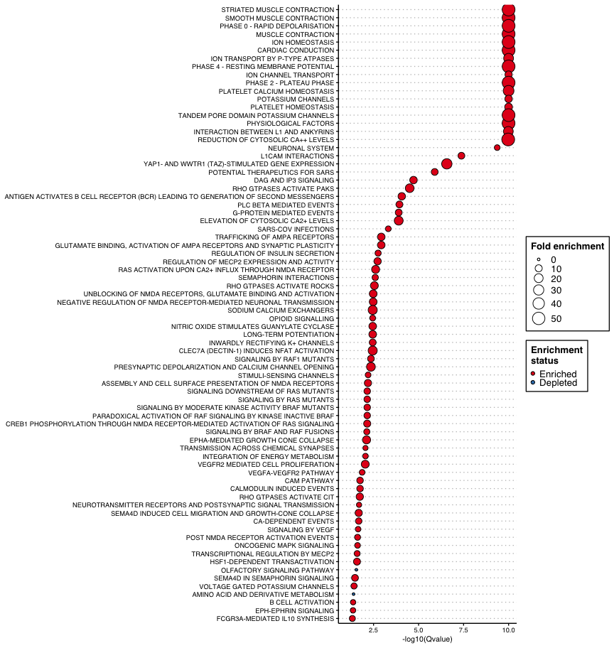
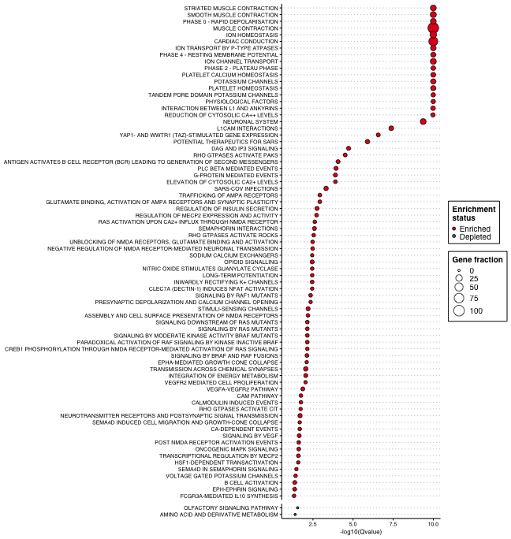

# FEDUP

FEDUP is an R package for enrichment and depletion analysis on user-defined
pathways using a Fisher's exact test. This package also gives the option to draw
a network representation of pathway overlaps using EnrichmentMap.

## Getting started
### System prerequisites

R version >= 4.0  
R packages:

* **CRAN**: openxlsx, tibble, dplyr, data.table, ggplot2, ggthemes, forcats, RColorBrewer  
* **Bioconductor**: RCy3

### Installation

Install FEDUP via devtools:


```r
#devtools::install_github("rosscm/FEDUP")
devtools::load_all()
```

## Quick run
### Data input

Load example test genes, background genes, and pathways:

To note, the test genes comprise solely of a **muscle contraction** pathway (Reactome ID 397014).
So we would expect to see strong *enrichment* for pathways related to muscle contraction and
*depletion* for pathways not associated with muscle contraction. Let's see!


```r
data(testGene)
data(backgroundGene)
data(pathwaysGMT)
```

Take a look at the data structure:


```r
str(testGene)
#>  chr [1:190] "NKX2-5" "SCN4A" "ITGB5" "SCN4B" "PAK2" "GATA4" "AKAP9" ...
str(backgroundGene)
#>  chr [1:10208] "PCYT1B" "PCYT1A" "PLA2G4D" "PLA2G4B" "PLA2G4C" "PLA2G4A" ...
str(head(pathwaysGMT))
#> List of 6
#>  $ GLYCEROPHOSPHOLIPID BIOSYNTHESIS%REACTOME%R-HSA-1483206.4                        : chr [1:126] "PCYT1B" "PCYT1A" "PLA2G4D" "PLA2G4B" ...
#>  $ MITOTIC PROPHASE%REACTOME DATABASE ID RELEASE 74%68875                           : chr [1:134] "SETD8" "NUMA1" "NCAPG2" "LMNB1" ...
#>  $ ACTIVATION OF NF-KAPPAB IN B CELLS%REACTOME%R-HSA-1169091.1                      : chr [1:67] "PSMA6" "PSMA3" "PSMA4" "PSMA1" ...
#>  $ CD28 DEPENDENT PI3K AKT SIGNALING%REACTOME DATABASE ID RELEASE 74%389357         : chr [1:22] "CD28" "THEM4" "AKT1" "TRIB3" ...
#>  $ UBIQUITIN-DEPENDENT DEGRADATION OF CYCLIN D%REACTOME DATABASE ID RELEASE 74%75815: chr [1:52] "PSMA6" "PSMA3" "PSMA4" "PSMA1" ...
#>  $ DEGRADATION OF THE EXTRACELLULAR MATRIX%REACTOME%R-HSA-1474228.4                 : chr [1:110] "PRSS1" "COL16A1" "COL12A1" "CAPN15" ...
```

### Pathway analysis

Now run FEDUP on sample data:


```r
fedup_res <- runFedup(testGene, backgroundGene, pathwaysGMT)
#> Data input:
#>  => 190 test genes
#>  => 10208 background genes
#>  => 1436 pathawys
#> You did it! FEDUP ran successfully, feeling pretty good huh?
```

View output results table sorted by pvalue:


```r
print(fedup_res)
#>                                                                                                                      pathway
#>    1:                                                              MUSCLE CONTRACTION%REACTOME DATABASE ID RELEASE 74%397014
#>    2:                                                             CARDIAC CONDUCTION%REACTOME DATABASE ID RELEASE 74%5576891
#>    3:                                                                               ION HOMEOSTASIS%REACTOME%R-HSA-5578775.2
#>    4:                                                       SMOOTH MUSCLE CONTRACTION%REACTOME DATABASE ID RELEASE 74%445355
#>    5:                                                                    STRIATED MUSCLE CONTRACTION%REACTOME%R-HSA-390522.1
#>   ---                                                                                                                       
#> 1432:                                                       G BETA:GAMMA SIGNALLING THROUGH PLC BETA%REACTOME%R-HSA-418217.3
#> 1433:                                          SIGNALING BY NOTCH1 HD+PEST DOMAIN MUTANTS IN CANCER%REACTOME%R-HSA-2894858.1
#> 1434:                                                                     IRAK4 DEFICIENCY (TLR2 4)%REACTOME%R-HSA-5603041.1
#> 1435: TNF RECEPTOR SUPERFAMILY (TNFSF) MEMBERS MEDIATING NON-CANONICAL NF-KB PATHWAY%REACTOME DATABASE ID RELEASE 74%5676594
#> 1436:                                                                     RHO GTPASES ACTIVATE KTN1%REACTOME%R-HSA-5625970.1
#>       size real_total real_pathway real_pathway_frac expected_total
#>    1:  190        190          190       100.0000000          10208
#>    2:  124        190          124        65.2631579          10208
#>    3:   51        190           51        26.8421053          10208
#>    4:   37        190           37        19.4736842          10208
#>    5:   34        190           34        17.8947368          10208
#>   ---                                                              
#> 1432:   20        190            0         0.0000000          10208
#> 1433:   57        190            1         0.5263158          10208
#> 1434:   11        190            0         0.0000000          10208
#> 1435:   16        190            0         0.0000000          10208
#> 1436:   11        190            0         0.0000000          10208
#>       expected_pathway expected_pathway_frac enrichment
#>    1:              190             1.8612853   Enriched
#>    2:              124             1.2147335   Enriched
#>    3:               51             0.4996082   Enriched
#>    4:               37             0.3624608   Enriched
#>    5:               34             0.3330721   Enriched
#>   ---                                                  
#> 1432:               20             0.1959248   Depleted
#> 1433:               57             0.5583856   Depleted
#> 1434:               11             0.1077586   Depleted
#> 1435:               16             0.1567398   Depleted
#> 1436:               11             0.1077586   Depleted
#>                               real_pathway_gene        pvalue        qvalue
#>    1:   NKX2-5,SCN4A,ITGB5,SCN4B,PAK2,GATA4,... 1.091522e-189 1.567426e-186
#>    2: NKX2-5,SCN4A,SCN4B,GATA4,AKAP9,KCNJ14,... 4.477692e-130 3.214983e-127
#>    3:    SLN,STIM1,ORAI2,ORAI1,ABCC9,KCNJ11,...  1.513045e-57  7.242444e-55
#>    4:      ITGB5,PAK2,ACTA2,VCL,MYL12B,MYL6,...  1.161897e-42  4.171211e-40
#>    5:          VIM,TNNI3,DMD,TPM4,TPM3,TPM2,...  2.009234e-39  5.770521e-37
#>   ---                                                                      
#> 1432:                                            1.000000e+00  1.000000e+00
#> 1433:                                     KAT2B  1.000000e+00  1.000000e+00
#> 1434:                                            1.000000e+00  1.000000e+00
#> 1435:                                            1.000000e+00  1.000000e+00
#> 1436:                                            1.000000e+00  1.000000e+00
```

### Visualization

Plot enriched and depleted pathways (qvalue < 5%) in the form of a dot plot:


```r
fedup_plot <- fedup_res[which(fedup_res$qvalue < 0.05),]
fedup_plot$log10qvalue <- -log10(fedup_plot$qvalue + 1e-10) # log10-transform qvalue for plotting
fedup_plot$pathway <- gsub("\\%.*", "", fedup_plot$pathway) # clean pathway names
p <- plotDotPlot(
  df = fedup_plot,
  x_var = "log10qvalue",
  y_var = "pathway",
  x_lab = "-log10(Qvalue)",
  fill_var = "enrichment",
  fill_lab = "Enrichment\nstatus",
  size_var = "real_pathway_frac",
  size_lab = "Gene fraction"
)
print(p)
```



As expected, we see strong enrichment for muscle-related pathways at the top of
the plot, and depletion for olfactory and amino acid metabolism pathways at the
bottom of the plot. Nice!

We can also facet the plot by enrichment status to clearly separate
the enriched and depleted pathways:


```r
p <- p +
  facet_grid("enrichment", scales = "free", space = "free") +
  theme(strip.text.y = element_blank())
print(p)
```



Look at all those chick... enrichments! This is a bit overwhelming, no? What if we
could see all these pathways in a summarised way that doesn't hurt our tired brains
even more? Oh I know... let's use an Enrichment Map!  

First, make sure to have [Cytoscape](https://cytoscape.org/download.html) downloaded
and and open on your computer. You'll also need to install the
[EnrichmentMap](http://apps.cytoscape.org/apps/enrichmentmap) and
[AutoAnnotate](http://apps.cytoscape.org/apps/autoannotate) apps.

Then format FEDUP results for compatibility with EnrichmentMap:


```r
results_file <- tempfile("fedup_res", fileext = ".txt")
writeFemap(fedup_res, results_file)
#> Wrote Cytoscape-formatted FEDUP results file to /var/folders/mh/_0z2r5zj3k75yhtgm6l7xy3m0000gn/T//RtmpLDDCxq/fedup_res110d12456e4f1.txt
```

Prepare a pathway annotation file (GMT format) from the pathway list you passed
to FEDUP (you don't need to run this function if your pathway annotations are
already in GMT format, but it doesn't hurt to make sure):


```r
gmt_file <- tempfile("pathwaysGMT", fileext = ".gmt")
writePathways(pathwaysGMT, gmt_file)
#> Wrote GMT file with 1436 pathway entries to /var/folders/mh/_0z2r5zj3k75yhtgm6l7xy3m0000gn/T//RtmpLDDCxq/pathwaysGMT110d15be9cf81.gmt
```

Cytoscape is open right? If so, let the magic happen:


```r
net_file <- tempfile("FEDUP_EM", fileext = ".png")
plotFemap(
  gmt_file = gmt_file,
  results_file = results_file,
  qvalue = 0.05,
  net_name = "FEDUP_EM",
  net_file = net_file
)
#> Error in curl::curl_fetch_memory(url, handle = handle): Failed to connect to localhost port 1234: Connection refused
```

## Versioning

For the versions available, see the [tags on this repo](https://github.com/rosscm/FEDUP/tags).

## Shoutouts

:sparkles:[**2020**](https://media.giphy.com/media/z9AUvhAEiXOqA/giphy.gif):sparkles:
