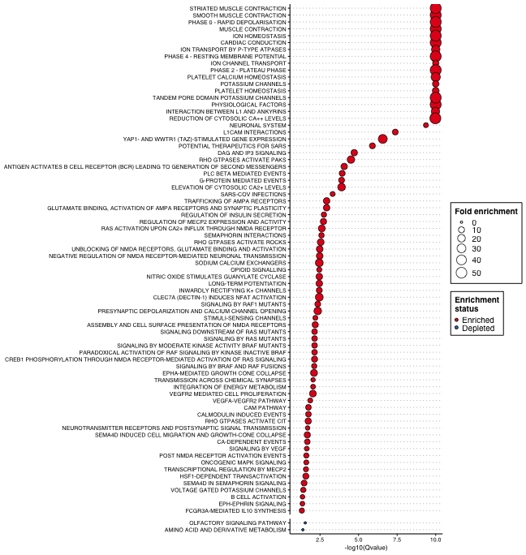

# FEDUP

FEDUP is an R package that tests for enrichment and depletion of
user-defined pathways using a Fisher’s exact test. This package is
designed for versatile pathway annotation formats (eg. gmt, txt, xlsx)
to allow the user to run pathway analysis on custom annotations.
FEDUP is also integrated with Cytoscape to provide network-based pathway
visualization that enhances the interpretability of the results.

## Getting started

### System prerequisites

R version >= 4.0  
R packages:

-   **CRAN**: openxlsx, tibble, dplyr, data.table, ggplot2, ggthemes,
    forcats, RColorBrewer  
-   **Bioconductor**: RCy3

### Installation

Install FEDUP via devtools:

    #devtools::install_github("rosscm/FEDUP")
    devtools::load_all()

## Quick run

### Data input

Load example test genes, background genes, and pathways:

To note, the test genes comprise solely of a **muscle contraction**
pathway (Reactome ID 397014). So we would expect to see strong
*enrichment* for pathways related to muscle contraction and *depletion*
for pathways not associated with muscle contraction. Let’s see!

    data(testGene)
    data(backgroundGene)
    data(pathwaysGMT)

Take a look at the data structure:

    str(testGene)
    #>  chr [1:190] "NKX2-5" "SCN4A" "ITGB5" "SCN4B" "PAK2" "GATA4" "AKAP9" ...
    str(backgroundGene)
    #>  chr [1:10208] "PCYT1B" "PCYT1A" "PLA2G4D" "PLA2G4B" "PLA2G4C" "PLA2G4A" ...
    str(head(pathwaysGMT))
    #> List of 6
    #>  $ REGULATION OF PLK1 ACTIVITY AT G2 M TRANSITION%REACTOME%R-HSA-2565942.1          : chr [1:84] "CSNK1E" "DYNLL1" "TUBG1" "CKAP5" ...
    #>  $ GLYCEROPHOSPHOLIPID BIOSYNTHESIS%REACTOME%R-HSA-1483206.4                        : chr [1:126] "PCYT1B" "PCYT1A" "PLA2G4D" "PLA2G4B" ...
    #>  $ MITOTIC PROPHASE%REACTOME DATABASE ID RELEASE 74%68875                           : chr [1:134] "SETD8" "NUMA1" "NCAPG2" "LMNB1" ...
    #>  $ ACTIVATION OF NF-KAPPAB IN B CELLS%REACTOME%R-HSA-1169091.1                      : chr [1:67] "PSMA6" "PSMA3" "PSMA4" "PSMA1" ...
    #>  $ CD28 DEPENDENT PI3K AKT SIGNALING%REACTOME DATABASE ID RELEASE 74%389357         : chr [1:22] "CD28" "THEM4" "AKT1" "TRIB3" ...
    #>  $ UBIQUITIN-DEPENDENT DEGRADATION OF CYCLIN D%REACTOME DATABASE ID RELEASE 74%75815: chr [1:52] "PSMA6" "PSMA3" "PSMA4" "PSMA1" ...

### Pathway analysis

Now run `FEDUP` on sample data:

    fedupRes <- runFedup(testGene, backgroundGene, pathwaysGMT)
    #> Data input:
    #>  => 190 test genes
    #>  => 10208 background genes
    #>  => 1437 pathawys
    #> You did it! FEDUP ran successfully, feeling pretty good huh?

View output results table sorted by pvalue:

    print(head(fedupRes[which(fedupRes$status == "Enriched"),]))
    #>                                                             pathway size
    #> 1:        MUSCLE CONTRACTION%REACTOME DATABASE ID RELEASE 74%397014  190
    #> 2:       CARDIAC CONDUCTION%REACTOME DATABASE ID RELEASE 74%5576891  124
    #> 3:                         ION HOMEOSTASIS%REACTOME%R-HSA-5578775.2   51
    #> 4: SMOOTH MUSCLE CONTRACTION%REACTOME DATABASE ID RELEASE 74%445355   37
    #> 5:              STRIATED MUSCLE CONTRACTION%REACTOME%R-HSA-390522.1   34
    #> 6:          PHASE 0 - RAPID DEPOLARISATION%REACTOME%R-HSA-5576892.2   31
    #>    real_frac expected_frac fold_enrichment   status
    #> 1: 100.00000     1.8612853        53.72632 Enriched
    #> 2:  65.26316     1.2147335        53.72632 Enriched
    #> 3:  26.84211     0.4996082        53.72632 Enriched
    #> 4:  19.47368     0.3624608        53.72632 Enriched
    #> 5:  17.89474     0.3330721        53.72632 Enriched
    #> 6:  16.31579     0.3036834        53.72632 Enriched
    #>                                     real_gene        pvalue        qvalue
    #> 1:    NKX2-5,SCN4A,ITGB5,SCN4B,PAK2,GATA4,... 1.091522e-189 1.568518e-186
    #> 2:  NKX2-5,SCN4A,SCN4B,GATA4,AKAP9,KCNJ14,... 4.477692e-130 3.217222e-127
    #> 3:     SLN,STIM1,ORAI2,ORAI1,ABCC9,KCNJ11,...  1.513045e-57  7.247487e-55
    #> 4:       ITGB5,PAK2,ACTA2,VCL,MYL12B,MYL6,...  1.161897e-42  4.174116e-40
    #> 5:           VIM,TNNI3,DMD,TPM4,TPM3,TPM2,...  2.009234e-39  5.774540e-37
    #> 6: SCN4A,SCN4B,SCN7A,SCN11A,SCN10A,CACNG6,...  3.621270e-36  8.672941e-34
    print(head(fedupRes[which(fedupRes$status == "Depleted"),]))
    #>                                                                                               pathway
    #> 1:                                 OLFACTORY SIGNALING PATHWAY%REACTOME DATABASE ID RELEASE 74%381753
    #> 2:                         AMINO ACID AND DERIVATIVE METABOLISM%REACTOME DATABASE ID RELEASE 74%71291
    #> 3:                                                                  DNA REPAIR%REACTOME%R-HSA-73894.3
    #> 4:                                                        GPCR LIGAND BINDING%REACTOME%R-HSA-500792.3
    #> 5: ANTIGEN PROCESSING: UBIQUITINATION & PROTEASOME DEGRADATION%REACTOME DATABASE ID RELEASE 74%983168
    #> 6:                           ASPARAGINE N-LINKED GLYCOSYLATION%REACTOME DATABASE ID RELEASE 74%446203
    #>    size real_frac expected_frac fold_enrichment   status real_gene      pvalue
    #> 1:  396 0.0000000      3.879310       0.0000000 Depleted           0.001390230
    #> 2:  368 0.0000000      3.605016       0.0000000 Depleted           0.002073172
    #> 3:  329 0.0000000      3.222962       0.0000000 Depleted           0.004692174
    #> 4:  454 0.5263158      4.447492       0.1183399 Depleted     ANXA1 0.005238539
    #> 5:  308 0.0000000      3.017241       0.0000000 Depleted           0.007054720
    #> 6:  286 0.0000000      2.801724       0.0000000 Depleted           0.010568697
    #>        qvalue
    #> 1: 0.02853944
    #> 2: 0.04081024
    #> 3: 0.08505496
    #> 4: 0.09293556
    #> 5: 0.11926627
    #> 6: 0.17258203

As expected, we see strong enrichment for muscle-related pathways and
depletion for functions not associated with muscle contraction, such as
olfactory signalling and amino acid metabolism). Nice!

### Visualization

Plot enriched and depleted pathways (qvalue &lt; 0.05) in the form of a
dot plot:

    fedupPlot <- fedupRes[which(fedupRes$qvalue < 0.05),]
    fedupPlot$log10qvalue <- -log10(fedupPlot$qvalue + 1e-10) # log10-transform qvalue for plotting
    fedupPlot$pathway <- gsub("\\%.*", "", fedupPlot$pathway) # clean pathway names
    p <- plotDotPlot(
      df=fedupPlot,
      xVar="log10qvalue",
      yVar="pathway",
      xLab="-log10(Qvalue)",
      fillVar="status",
      fillLab="Enrichment\nstatus",
      sizeVar="fold_enrichment",
      sizeLab="Fold enrichment")
    p <- p + # facet by status to separate enriched and depleted pathways
      facet_grid("status", scales="free", space="free") +
      theme(strip.text.y=element_blank())
    print(p)

Look at all those chick… enrichments! This is a bit overwhelming, no?
How do we interpret these 76 fairly redundant pathways meaningfully?
What if we could summarize them in a way that doesn’t hurt our tired
brains even more? Oh I know, let’s use EnrichmentMap!

First, make sure to have
[Cytoscape](https://cytoscape.org/download.html) downloaded and and open
on your computer. You’ll also need to install the
[EnrichmentMap](http://apps.cytoscape.org/apps/enrichmentmap) and
[AutoAnnotate](http://apps.cytoscape.org/apps/autoannotate) apps.

Then format `FEDUP` results for compatibility with EnrichmentMap:

    resultsFile <- tempfile("fedupRes", fileext=".txt")
    writeFemap(fedupRes, resultsFile)
    #> Wrote Cytoscape-formatted FEDUP results file to /var/folders/mh/_0z2r5zj3k75yhtgm6l7xy3m0000gn/T//RtmpMMbNpg/fedupRes181796b099542.txt

Prepare a pathway annotation file (GMT format) from the pathway list you
passed to `FEDUP` (you don’t need to run this function if your pathway
annotations are already in GMT format, but it doesn’t hurt to make
sure):

    gmtFile <- tempfile("pathwaysGMT", fileext=".gmt")
    writePathways(pathwaysGMT, gmtFile)
    #> Wrote out GMT file with to /var/folders/mh/_0z2r5zj3k75yhtgm6l7xy3m0000gn/T//RtmpMMbNpg/pathwaysGMT181796316cf19.gmt

Cytoscape is open right? If so, uncomment these lines and let the magic
happen:

    #netFile <- tempfile("FEDUP_EM", fileext=".png")
    #plotFemap(
    #  gmtFile=gmtFile,
    #  resultsFile=resultsFile,
    #  qvalue=0.05,
    #  netName="FEDUP_EM",
    #  netFile=netFile)

After some manual rearrangement of the annotated pathway clusters, this
is the resulting Enrichment Map we get from our `FEDUP` results. Much
better!

This has effectively summarized the 76 pathways from our dot plot into
14 unique biological themes (including 4 unclustered pathways). We can
now see clear themes in the data pertaining to muscle contraction, such
as NMDA receptor function, calcium homeostasis, and ATPase transport.

Try this out yourself! Hopefully it’s the only fedup you achieve
:grimacing:

## Versioning

For the versions available, see the [tags on this
repo](https://github.com/rosscm/FEDUP/tags).

## Shoutouts

:sparkles:[**2020**](https://media.giphy.com/media/z9AUvhAEiXOqA/giphy.gif):sparkles:
