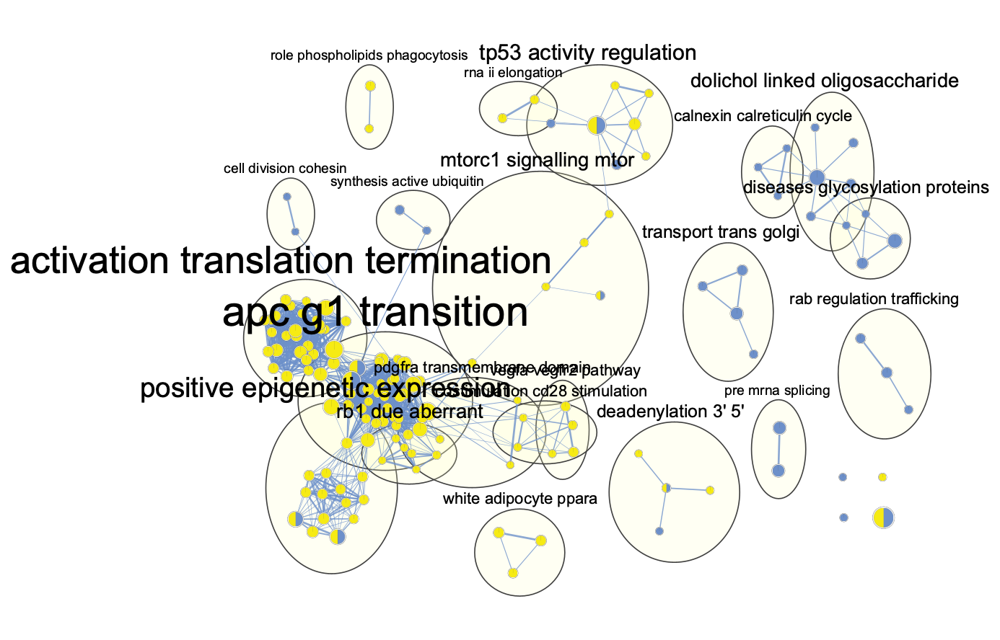

<div align="center">

**F**isher’s Test for **E**nrichment and **D**epletion of
**U**ser-Defined **P**athways


[](https://travis-ci.com/rosscm/fedup)


[](https://codecov.io/gh/rosscm/fedup)

<div align="left">

`fedup` is an R package that tests for enrichment and depletion of
user-defined pathways using a Fisher’s exact test. The method is
designed for versatile pathway annotation formats (eg. gmt, txt, xlsx)
to allow the user to run pathway analysis on custom annotations. This
package is also integrated with Cytoscape to provide network-based
pathway visualization that enhances the interpretability of the results.

This README will quickly demonstrate how to use `fedup` when testing two
sets of genes. Refer to vignettes for additional information and
implementations (e.g., using single or multiple test sets).

# Contents

-   [System prerequisites](#system-prerequisites)
-   [Installation](#installation)
-   [Running the package](#running-the-package)
    -   [Input data](#input-data)
    -   [Pathway analysis](#pathway-analysis)
    -   [Dot plot](#dot-plot)
    -   [Enrichment map](#enrichment-map)
-   [Versioning](#versioning)
-   [Shoutouts](#shoutouts)

# System prerequisites

**R version** ≥ 4.1  
**R packages**:

-   **CRAN**: openxlsx, tibble, dplyr, data.table, ggplot2, ggthemes,
    forcats, RColorBrewer  
-   **Bioconductor**: RCy3

# Installation

Install `fedup` from Bioconductor:

``` r
if(!requireNamespace("BiocManager", quietly = TRUE))
    install.packages("BiocManager")
BiocManager::install("fedup")
```

Or install the development version from Github:

``` r
devtools::install_github("rosscm/fedup", quiet = TRUE)
```

Load necessary packages:

``` r
#library(fedup)
library(dplyr)
library(tidyr)
library(ggplot2)
```

# Running the package

## Input data

Load test genes (`geneDouble`) and pathways annotations (`pathwaysGMT`):

``` r
data(geneDouble)
data(pathwaysGMT)
```

Take a look at the data structure:

``` r
str(geneDouble)
#> List of 3
#>  $ background   : chr [1:17804] "SLCO4A1" "PGRMC2" "LDLR" "RABL3" ...
#>  $ FASN_negative: chr [1:379] "SLCO4A1" "PGRMC2" "LDLR" "RABL3" ...
#>  $ FASN_positive: chr [1:298] "CDC34" "PRKCE" "SMARCC2" "EIF3A" ...
str(head(pathwaysGMT))
#> List of 6
#>  $ REGULATION OF PLK1 ACTIVITY AT G2 M TRANSITION%REACTOME%R-HSA-2565942.1          : chr [1:84] "CSNK1E" "DYNLL1" "TUBG1" "CKAP5" ...
#>  $ GLYCEROPHOSPHOLIPID BIOSYNTHESIS%REACTOME%R-HSA-1483206.4                        : chr [1:126] "PCYT1B" "PCYT1A" "PLA2G4D" "PLA2G4B" ...
#>  $ MITOTIC PROPHASE%REACTOME DATABASE ID RELEASE 74%68875                           : chr [1:134] "SETD8" "NUMA1" "NCAPG2" "LMNB1" ...
#>  $ ACTIVATION OF NF-KAPPAB IN B CELLS%REACTOME%R-HSA-1169091.1                      : chr [1:67] "PSMA6" "PSMA3" "PSMA4" "PSMA1" ...
#>  $ CD28 DEPENDENT PI3K AKT SIGNALING%REACTOME DATABASE ID RELEASE 74%389357         : chr [1:22] "CD28" "THEM4" "AKT1" "TRIB3" ...
#>  $ UBIQUITIN-DEPENDENT DEGRADATION OF CYCLIN D%REACTOME DATABASE ID RELEASE 74%75815: chr [1:52] "PSMA6" "PSMA3" "PSMA4" "PSMA1" ...
```

## Pathway analysis

Now use `runFedup` on the sample data:

``` r
fedupRes <- runFedup(geneDouble, pathwaysGMT)
#> Running fedup with:
#>  => 2 test set(s)
#>   + FASN_negative: 379 genes
#>   + FASN_positive: 298 genes
#>  => 17804 background genes
#>  => 1437 pathway annotations
#> All done!
```

The `fedupRes` output is a list of length
`length(which(names(geneDouble) != "background"))`, corresponding to the
number of test sets in `geneDouble` (i.e., 2).

View `fedup` results for `FASN_negative` sorted by pvalue:

``` r
set <- "FASN_negative"
print(head(fedupRes[[set]][which(fedupRes[[set]]$status == "enriched"),]))
#>                                                                                                                                          pathway
#> 1:                                                                      ASPARAGINE N-LINKED GLYCOSYLATION%REACTOME DATABASE ID RELEASE 74%446203
#> 2: BIOSYNTHESIS OF THE N-GLYCAN PRECURSOR (DOLICHOL LIPID-LINKED OLIGOSACCHARIDE, LLO) AND TRANSFER TO A NASCENT PROTEIN%REACTOME%R-HSA-446193.1
#> 3:                                                  DISEASES ASSOCIATED WITH N-GLYCOSYLATION OF PROTEINS%REACTOME DATABASE ID RELEASE 74%3781860
#> 4:                                                        INTRA-GOLGI AND RETROGRADE GOLGI-TO-ER TRAFFIC%REACTOME DATABASE ID RELEASE 74%6811442
#> 5:                                                                         RAB REGULATION OF TRAFFICKING%REACTOME DATABASE ID RELEASE 74%9007101
#> 6:                                                                                            DISEASES OF GLYCOSYLATION%REACTOME%R-HSA-3781865.1
#>    size real_frac expected_frac fold_enrichment   status
#> 1:  286  8.179420    1.53336329        5.334300 enriched
#> 2:   78  3.693931    0.42125365        8.768901 enriched
#> 3:   17  2.110818    0.09548416       22.106472 enriched
#> 4:  183  4.749340    0.99415862        4.777246 enriched
#> 5:  120  3.693931    0.62345540        5.924933 enriched
#> 6:  139  3.957784    0.74702314        5.298074 enriched
#>                                     real_gene       pvalue       qvalue
#> 1:      MOGS,DOLPP1,ALG9,ALG12,ALG3,MPDU1,... 1.596605e-12 2.294321e-09
#> 2:      DOLPP1,ALG9,ALG12,ALG3,MPDU1,ALG8,... 6.358461e-09 4.568554e-06
#> 3:       MOGS,ALG9,ALG12,ALG3,MPDU1,MGAT2,... 3.054616e-08 1.463161e-05
#> 4:  ARL1,RAB18,RAB3GAP2,VPS52,NAA35,TMED9,... 2.516179e-07 9.039372e-05
#> 5: RAB18,TSC1,RAB3GAP2,TSC2,TBC1D20,RAB10,... 4.945154e-07 1.421237e-04
#> 6:       MOGS,ALG9,ALG12,ALG3,MPDU1,MGAT2,... 7.240716e-07 1.734151e-04
print(head(fedupRes[[set]][which(fedupRes[[set]]$status == "depleted"),]))
#>                                                               pathway size
#> 1:                        GPCR LIGAND BINDING%REACTOME%R-HSA-500792.3  454
#> 2: OLFACTORY SIGNALING PATHWAY%REACTOME DATABASE ID RELEASE 74%381753  396
#> 3:       CLASS A 1 (RHODOPSIN-LIKE RECEPTORS)%REACTOME%R-HSA-373076.7  323
#> 4:             NEURONAL SYSTEM%REACTOME DATABASE ID RELEASE 74%112316  379
#> 5:           PEPTIDE LIGAND-BINDING RECEPTORS%REACTOME%R-HSA-375276.5  195
#> 6:             KERATINIZATION%REACTOME DATABASE ID RELEASE 74%6805567  217
#>    real_frac expected_frac fold_enrichment   status    real_gene      pvalue
#> 1: 0.0000000     2.3702539       0.0000000 depleted              0.000318537
#> 2: 0.0000000     1.9096832       0.0000000 depleted              0.001508862
#> 3: 0.0000000     1.6906313       0.0000000 depleted              0.003316944
#> 4: 0.5277045     2.0950348       0.2518834 depleted KCNK2,PRKAB1 0.026904721
#> 5: 0.0000000     1.0166255       0.0000000 depleted              0.057057149
#> 6: 0.0000000     0.8425073       0.0000000 depleted              0.079543380
#>        qvalue
#> 1: 0.01760530
#> 2: 0.05420587
#> 3: 0.10361845
#> 4: 0.42024004
#> 5: 0.57670567
#> 6: 0.67813171
```

Let’s also view `fedup` results for `FASN_positive`, sorted by pvalue:

``` r
set <- "FASN_positive"
print(head(fedupRes[[set]][which(fedupRes[[set]]$status == "enriched"),]))
#>                                                                                          pathway
#> 1:     L13A-MEDIATED TRANSLATIONAL SILENCING OF CERULOPLASMIN EXPRESSION%REACTOME%R-HSA-156827.3
#> 2: GTP HYDROLYSIS AND JOINING OF THE 60S RIBOSOMAL SUBUNIT%REACTOME DATABASE ID RELEASE 74%72706
#> 3:                    CAP-DEPENDENT TRANSLATION INITIATION%REACTOME DATABASE ID RELEASE 74%72737
#> 4:                                      EUKARYOTIC TRANSLATION INITIATION%REACTOME%R-HSA-72613.3
#> 5:                               TRANSLATION INITIATION COMPLEX FORMATION%REACTOME%R-HSA-72649.3
#> 6:          RIBOSOMAL SCANNING AND START CODON RECOGNITION%REACTOME DATABASE ID RELEASE 74%72702
#>    size real_frac expected_frac fold_enrichment   status
#> 1:  112  7.382550     0.4718041        15.64749 enriched
#> 2:  113  7.382550     0.4774208        15.46340 enriched
#> 3:  120  7.382550     0.5167378        14.28684 enriched
#> 4:  120  7.382550     0.5167378        14.28684 enriched
#> 5:   59  5.369128     0.2583689        20.78086 enriched
#> 6:   59  5.369128     0.2583689        20.78086 enriched
#>                                 real_gene       pvalue       qvalue
#> 1: EIF3A,RPL35,EIF3D,RPS3,EIF3G,EIF4H,... 9.628857e-18 8.562503e-15
#> 2: EIF3A,RPL35,EIF3D,RPS3,EIF3G,EIF4H,... 1.191719e-17 8.562503e-15
#> 3: EIF3A,RPL35,EIF3D,RPS3,EIF3G,EIF4H,... 4.970934e-17 1.785808e-14
#> 4: EIF3A,RPL35,EIF3D,RPS3,EIF3G,EIF4H,... 4.970934e-17 1.785808e-14
#> 5:  EIF3A,EIF3D,RPS3,EIF3G,EIF4H,RPS5,... 5.796507e-15 1.388264e-12
#> 6:  EIF3A,EIF3D,RPS3,EIF3G,EIF4H,RPS5,... 5.796507e-15 1.388264e-12
print(head(fedupRes[[set]][which(fedupRes[[set]]$status == "depleted"),]))
#>                                                                         pathway
#> 1:                                  GPCR LIGAND BINDING%REACTOME%R-HSA-500792.3
#> 2:                       NEURONAL SYSTEM%REACTOME DATABASE ID RELEASE 74%112316
#> 3:           OLFACTORY SIGNALING PATHWAY%REACTOME DATABASE ID RELEASE 74%381753
#> 4:                 CLASS A 1 (RHODOPSIN-LIKE RECEPTORS)%REACTOME%R-HSA-373076.7
#> 5:                        G ALPHA (I) SIGNALLING EVENTS%REACTOME%R-HSA-418594.6
#> 6: TRANSMISSION ACROSS CHEMICAL SYNAPSES%REACTOME DATABASE ID RELEASE 74%112315
#>    size real_frac expected_frac fold_enrichment   status real_gene      pvalue
#> 1:  454 0.0000000      2.370254       0.0000000 depleted           0.002390509
#> 2:  379 0.0000000      2.095035       0.0000000 depleted           0.005261657
#> 3:  396 0.0000000      1.909683       0.0000000 depleted           0.007449873
#> 4:  323 0.0000000      1.690631       0.0000000 depleted           0.017309826
#> 5:  396 0.3355705      2.106268       0.1593199 depleted    AHCYL1 0.034808044
#> 6:  238 0.0000000      1.314311       0.0000000 depleted           0.035700272
#>        qvalue
#> 1: 0.03240718
#> 2: 0.05953545
#> 3: 0.07989155
#> 4: 0.13667154
#> 5: 0.21016453
#> 6: 0.21198880
```

## Dot plot

Prepare data for plotting via `dplyr` and `tidyr`:

``` r
fedupPlot <- fedupRes %>%
    bind_rows(.id = "set") %>%
    separate(col = "set", into = c("set", "sign"), sep = "_") %>%
    subset(qvalue < 0.05) %>%
    mutate(log10qvalue = -log10(qvalue)) %>%
    mutate(pathway = gsub("\\%.*", "", pathway)) %>%
    mutate(status = factor(status, levels = c("enriched", "depleted"))) %>%
    as.data.frame()
```

Plot significant results (qvalue &lt; 0.05) in the form of a dot plot
via `plotDotPlot`. Colour and facet the points by the `sign` column:

``` r
p <- plotDotPlot(
        df = fedupPlot,
        xVar = "log10qvalue",
        yVar = "pathway",
        xLab = "-log10(qvalue)",
        fillVar = "sign",
        fillLab = "Genetic interaction",
        fillCol = c("#6D90CA", "#F6EB13"),
        sizeVar = "fold_enrichment",
        sizeLab = "Fold enrichment") +
    facet_grid("sign", scales = "free", space = "free") +
    theme(strip.text.y = element_blank())
print(p)
```


Look at all those chick… enrichments! This is a bit overwhelming, isn’t
it? How do we interpret these 156 fairly redundant pathways in a way
that doesn’t hurt our tired brains even more? Oh I know, let’s use an
enrichment map!

First, make sure to have
[Cytoscape](https://cytoscape.org/download.html) downloaded and and open
on your computer. You’ll also need to install the
[EnrichmentMap](http://apps.cytoscape.org/apps/enrichmentmap) and
[AutoAnnotate](http://apps.cytoscape.org/apps/autoannotate) apps.

Then format results for compatibility with EnrichmentMap with
`writeFemap`:

``` r
resultsFolder <- tempdir()
writeFemap(fedupRes, resultsFolder)
#> Wrote out EM-formatted fedup results file to /var/folders/mh/_0z2r5zj3k75yhtgm6l7xy3m0000gn/T//RtmpAf2BGG/femap_FASN_negative.txt
#> Wrote out EM-formatted fedup results file to /var/folders/mh/_0z2r5zj3k75yhtgm6l7xy3m0000gn/T//RtmpAf2BGG/femap_FASN_positive.txt
```

Prepare a pathway annotation file (gmt format) from the pathway list you
passed to `runFedup` using the `writePathways` function (you don’t need
to run this function if your pathway annotations are already in gmt
format, but it doesn’t hurt to make sure):

``` r
gmtFile <- tempfile("pathwaysGMT", fileext = ".gmt")
writePathways(pathwaysGMT, gmtFile)
#> Wrote out pathway gmt file to /var/folders/mh/_0z2r5zj3k75yhtgm6l7xy3m0000gn/T//RtmpAf2BGG/pathwaysGMT71ec2744960.gmt
```

Cytoscape is open right? If so, run these lines and let the `plotFemap`
magic happen:

``` r
netFile <- tempfile("fedupEM_geneDouble", fileext = ".png")
plotFemap(
    gmtFile = gmtFile,
    resultsFolder = resultsFolder,
    qvalue = 0.05,
    chartData = "DATA_SET",
    hideNodeLabels = TRUE,
    netName = "fedupEM_geneDouble",
    netFile = netFile
)
```

To note here, the EM nodes were coloured manually (by the same colours
passed to `plotDotPlot`) in Cytoscape via the *Change Colors* option in
the EM panel. A feature for automated dataset colouring is set to be
released in [version
3.3.2](https://github.com/BaderLab/EnrichmentMapApp/issues/455) of
EnrichmentMap.



This has effectively summarized the 156 pathways from our dot plot into
21 unique biological themes (including 4 unclustered pathways). We can
now see clear themes in the data pertaining to negative *FASN* genetic
interactions, such as `diseases glycosylation, proteins`,
`golgi transport`, and `rab regulation trafficking`. These can be
compared and constrasted with the enrichment seen for *FASN* positive
interactions.

Try this out yourself! Hopefully it’s the only fedup you achieve
:grimacing:

# Versioning

For the versions available, see the [tags on this
repo](https://github.com/rosscm/fedup/tags).

# Shoutouts

:sparkles:[**2020**](https://media.giphy.com/media/z9AUvhAEiXOqA/giphy.gif):sparkles:
