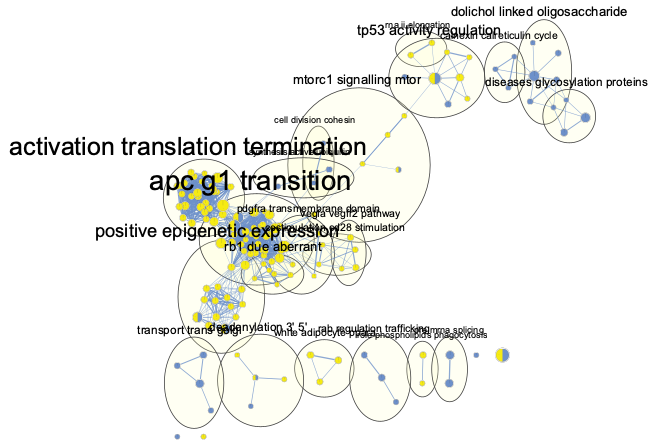

```{r, include = FALSE}
knitr::opts_chunk$set(
    collapse = TRUE,
    comment = "#>",
    fig.path = "vignettes/figures/",
    out.width = "100%"
)
```

This is an R package that tests for enrichment and depletion of user-defined
pathways using a Fisher's exact test. The method is designed for versatile
pathway annotation formats (eg. gmt, txt, xlsx) to allow the user to run
pathway analysis on custom annotations. This package is also
integrated with Cytoscape to provide network-based pathway visualization
that enhances the interpretability of the results.

This vignette will explain how to use `fedup` when testing two sets of genes
for pathway enrichment and depletion.

# System prerequisites

**R version** ≥ 4.1    
**R packages**:

* **CRAN**: openxlsx, tibble, dplyr, data.table, ggplot2, ggthemes, forcats,
RColorBrewer
* **Bioconductor**: RCy3

# Installation

Install `fedup` from Bioconductor:

```{r, eval = FALSE, message = FALSE}
if(!requireNamespace("BiocManager", quietly = TRUE))
    install.packages("BiocManager")
BiocManager::install("fedup")
```

Or install the development version from Github:

```{r, message = FALSE}
devtools::install_github("rosscm/fedup", quiet = TRUE)
```

Load necessary packages:

```{r, message = FALSE}
library(fedup)
library(dplyr)
library(tidyr)
library(ggplot2)
```

# Running the package
## Input data

Load test genes (`geneDouble`) and pathways annotations (`pathwaysGMT`):

```{r}
data(geneDouble)
data(pathwaysGMT)
```

Take a look at the data structure:

```{r}
str(geneDouble)
str(head(pathwaysGMT))
```

To see more info on this data, run `?geneDouble` or `?pathwaysGMT`. You
could also run `example("prepInput", package = "fedup")` or
`example("readPathways", package = "fedup")` to see exactly how the data
was generated using the `prepInput()` and `readPathways()` functions.
`?` and `example()` can be used on any other functions mentioned here to
see their documentation and run examples.

The sample `geneDouble` list object contains three vector elements: `background`
, `FASN_negative`, and `FASN_positive`. The `background` consists of all genes
that the test sets (in this case `FASN_negative` and `FASN_positive`) will be
compared against. `FASN_negative` consists of genes that form
**negative genetic interactions** with the FASN gene after CRISPR-Cas9 knockout.
`FASN_positive` consists of genes that form **positve genetic interactions**
with *FASN*. If you're interested in seeing how this data set was
constructed, check out the
[code](https://github.com/rosscm/fedup/blob/main/inst/script/genes.R).
Also, the paper the data was taken from is found
[here](https://www.ncbi.nlm.nih.gov/pmc/articles/PMC7566881/).

Given that [*FASN*](https://www.genecards.org/cgi-bin/carddisp.pl?gene=FASN) is
a fatty acid synthase, we would expect to see **enrichment** of the negative
interactions for pathways associated with *sensitization* of fatty acid
synthesis, as well as **enrichment** of the positive interactions for pathways
associated with *suppression* of the function. Conversely, we expect to find
**depletion** for pathways not at all involved with *FASN* biology. Let's see!

## Pathway analysis

Now use `runFedup` on the sample data:

```{r}
fedupRes <- runFedup(geneDouble, pathwaysGMT)
```

The `fedupRes` output is a list of length `length(which(names(geneDouble) !=
"background"))`, corresponding to the number of test sets in `geneDouble`
(i.e., 2).

View `fedup` results for `FASN_negative` sorted by pvalue:

```{r}
set <- "FASN_negative"
print(head(fedupRes[[set]][which(fedupRes[[set]]$status == "enriched"),]))
print(head(fedupRes[[set]][which(fedupRes[[set]]$status == "depleted"),]))
```

Here we see the strongest enrichment for the `ASPARAGINE N-LINKED GLYCOSYLATION`
pathway. Given that *FASN* mutant cells show a strong dependence on lipid
uptake, this enrichment for negative interactions with genes involved in
glycosylation is expected. We also see significant enrichment for other related
pathways, including `DISEASES ASSOCIATED WITH N-GLYCOSYLATION OF PROTEINS` and
`DISEASES OF GLYCOSYLATION`. Conversely, we see significant depletion for
functions not associated with these processes, such as `OLFACTORY SIGNALING
PATHWAY`, `GPCR LIGAND BINDING` and `KERATINIZATION`. Nice!

Let's also view `fedup` results for `FASN_positive`, sorted by pvalue:

```{r}
set <- "FASN_positive"
print(head(fedupRes[[set]][which(fedupRes[[set]]$status == "enriched"),]))
print(head(fedupRes[[set]][which(fedupRes[[set]]$status == "depleted"),]))
```

## Dot plot

Prepare data for plotting via `dplyr` and `tidyr`:

```{r}
fedupPlot <- fedupRes %>%
    bind_rows(.id = "set") %>%
    separate(col = "set", into = c("set", "sign"), sep = "_") %>%
    subset(qvalue < 0.05) %>%
    mutate(log10qvalue = -log10(qvalue)) %>%
    mutate(pathway = gsub("\\%.*", "", pathway)) %>%
    as.data.frame()
```

Since we're dealing with two test sets here, it's important we create the
`sign` column in `fedupPlot` to distinguish between them. Take a look at
`?dplyr::bind_rows` for details on how the output `fedup` results list
(`fedupRes`) was bound into a single dataframe and `?tidyr::separate` for how
the `sign` column was created.

Plot significant results (qvalue < 0.05) in the form of a dot plot via
`plotDotPlot`. Colour and facet the points by the `sign` column:

```{r, fedupDotPlot, fig.width = 11, fig.height = 15.5}
p <- plotDotPlot(
        df = fedupPlot,
        xVar = "log10qvalue",
        yVar = "pathway",
        xLab = "-log10(qvalue)",
        fillVar = "sign",
        fillLab = "Genetic interaction",
        fillCol = c("#6D90CA", "#F6EB13"),
        sizeVar = "fold_enrichment",
        sizeLab = "Fold enrichment") +
    facet_grid("sign", scales = "free", space = "free") +
    theme(strip.text.y = element_blank())
print(p)
```

Look at all those chick... enrichments! This is a bit overwhelming, isn't it?
How do we interpret these 156 fairly redundant pathways in a way that doesn't
hurt our tired brains even more? Oh I know, let's use an enrichment map!

## Enrichment map

First, make sure to have [Cytoscape](https://cytoscape.org/download.html)
downloaded and and open on your computer. You'll also need to install the
[EnrichmentMap](http://apps.cytoscape.org/apps/enrichmentmap) (≥ v3.3.0)
and [AutoAnnotate](http://apps.cytoscape.org/apps/autoannotate) apps.

Then format results for compatibility with EnrichmentMap using `writeFemap`:

```{r}
resultsFolder <- tempdir()
writeFemap(fedupRes, resultsFolder)
```

Prepare a pathway annotation file (gmt format) from the pathway list you
passed to `runFedup` using the `writePathways` function (you don't need to run
this function if your pathway annotations are already in gmt format, but it
doesn't hurt to make sure):

```{r}
gmtFile <- tempfile("pathwaysGMT", fileext = ".gmt")
writePathways(pathwaysGMT, gmtFile)
```

Cytoscape is open right? If so, run these lines and let the `plotFemap`
magic happen:

```{r, fedupEM_geneDouble, eval = FALSE}
netFile <- tempfile("fedupEM_geneDouble", fileext = ".png")
plotFemap(
    gmtFile = gmtFile,
    resultsFolder = resultsFolder,
    qvalue = 0.05,
    chartData = "DATA_SET",
    hideNodeLabels = TRUE,
    netName = "fedupEM_geneDouble",
    netFile = netFile
)
```



To note here, the EM nodes were coloured manually (by the same colours passed to
`plotDotPlot`) in Cytoscape via the *Change Colors* option in the EM panel.
A feature for automated dataset colouring is set to be released in
[version 3.3.2](https://github.com/BaderLab/EnrichmentMapApp/issues/455)
of EnrichmentMap.

This has effectively summarized the 156 pathways from our dot plot into 21
unique biological themes (including 4 unclustered pathways). We can now see
clear themes in the data pertaining to negative *FASN* genetic interactions,
such as `diseases glycosylation, proteins`, `golgi transport`, and
`rab regulation trafficking`. These can be compared and constrasted with the
enrichment seen for *FASN* positive interactions.

# Session information

```{r}
sessionInfo()
```
